Title: Investigación de Caso: Adopción en refugio animal 
Date: 2023-10-15
Category: 2. Casos de Estudio

## Introducción  
Se nos plantea un problema de clasificación, donde contamos con dos conjuntos de datos, de entrada de animales al refugio y de salida. Este ejercicio plantea un objetivo a primera vista noble, pero que conlleva una pre producción de datos considerable dada la naturaleza de los datos que se cuentan y los datos que podamos razonar que necesitamos o influyen en el objetivo. En este caso nos apoyaremos en el Turbo Prep de Rapidminer mucho.  

## Contexto del problema  
Todos los días nos encontramos con animales sin hogar, desde el perro en la calle al gato que queda en la casa de una familia que se vá o la cabra que se escapó de su granja, para todos estos animales corresponde y se merecen un hogar y en general son los refugios de animales quienes los reciben en periodos de transición para que estas criaturas puedan llegar a un nuevo hogar. Estos refugios suelen manejar fondos cortos y muchos animales, por lo que deben ser precavidos con quienes reciben y quienes pasan a otros refugios o casas de transición, por lo que hoy veremos un modelo que les permita intentar de predecir si una mascota es probable que sea adoptada en el refugio en el que está o si es mejor que vaya a otro a buscar su hogar permanente.  

## Evaluación de los datos  
Contamos con 2 datasets distintos, los cuales reflejan registros de entrada y salida de animales del refugio, más algunos datos de las mascotas y las características de su llegada y su salida. Ambos cuentan con 10.000 tuplas.  

### En los registros de entrada tenemos 12 atributos:  
- animal_id  (Categórico, id único de la mascota)  
- name (Categórico, nombre de la mascota)  
- datetime (FechaHora, cuando llego al refugio)  
- monthyear (FechaHora, cuando llego al refugio)  
- found_location (Categórico, dirección donde se encontró)  
- intake_type (Categórico, como llegó al refugio Ej: de la calle, entregado por el dueño, etc.)  
- intake_condition (Categórico, condición como llegó al refugio Ej: enfermo, normal, etc.)  
- animal_type (Categórico, que animal es)  
- sex_upon_intake (Categórico, el genero del animal y si está castrado o no)  
- age_upon_intake (Categórico, edad del animal cuando llegó)  
- breed (Categórico, raza del animal)  
- color (Categórico, color/es del animal)  

### En los registros de salida tenemos también 12 atributos:  
- animal_id  (Categórico, id único de la mascota)  
- name (Categórico, nombre de la mascota)  
- datetime (FechaHora, cuando llego al refugio)  
- monthyear (FechaHora, cuando llego al refugio)  
- date_of_birth (Fecha, cuando se estima que nació el animal)  
- outcome_type (Categórico, como se fue del refugio Ej: devuelto al dueño, adoptado, etc.)  
- outcome_subtype (Categórico, más detalle de como se fué, solo aplicable a algunos valores de outcome_type sino nulo)    
- animal_type (Categórico, que animal es)  
- sex_upon_outcome (Categórico, el genero del animal y si está castrado o no)  
- age_upon_outcome (Categórico, edad del animal cuando se fué)  
- breed (Categórico, raza del animal)  
- color (Categórico, color/es del animal)  

### De evaluar los datos sacamos las siguientes conclusiones y/o transformaciones necesarias:  
- datetime y monthyear de ambos sets contienen los mismos datos, por lo que una de las dos puede eliminarse.  
- Tenemos la el momento en el que llega o se va el animal y la edad respecto a estas fechas, probablemente sea más manejable utilizar un atributo de  fecha de nacimiento para ambas tablas para poder predecir mejor en base de este atributo importante (cachorros son más propensos a ser adoptados).  
- Datos como nombre o ubicación donde lo rescataron seguramente no influyan mucho sobre si se va a adoptar al animal o no.  
- Tenemos tanto el genero del animal como si está castrado o no en el mismo atributo, esto podríamos separarlo.  
- En la tabla de salidas tenemos amplias razones por la que el animal abandona el refugio, pero para el presente trabajo nos interesa si fue adoptado o no, por lo que podemos reducir el atributo a estas dos opciones unicamente.  
- Un subtipo de adopción es que fué enviado a una casa transitoria. A efectos de este estudio no lo consideraremos como caso favorable.  
- Las edades registradas fueron ingresadas como "n years" o "n weeks" entre otros, deberemos plantear una medida de tiempo común para todos estos para poder aprovechar el dato numérico y calcular las edades reales de las mascotas.  

## Estadísticas de los datos  
De Rapidminer sacamos los siguientes datos de los sets tal cual están:  
### Set Intakes:  
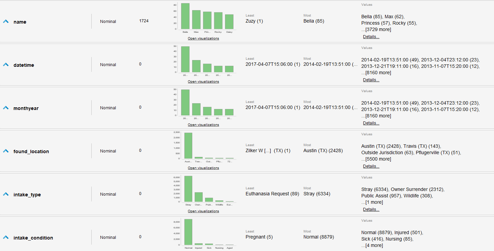  
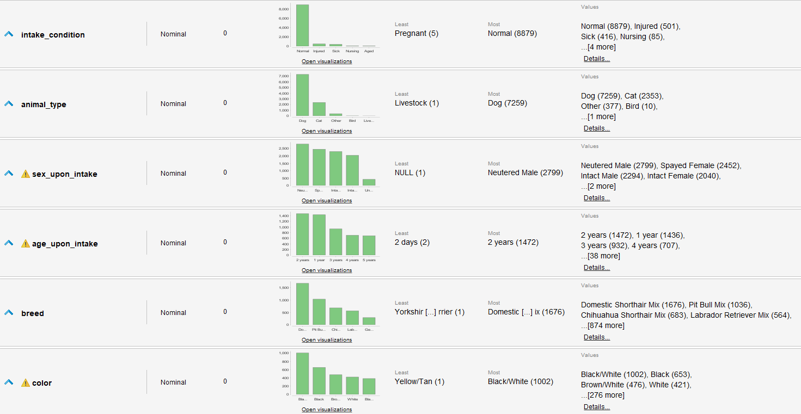  

### Set Outcomes:  
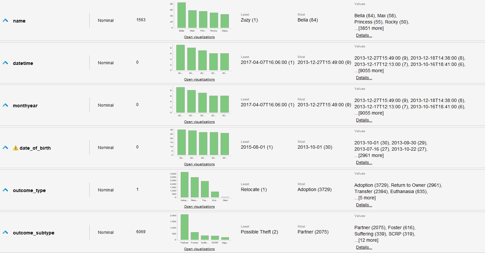  
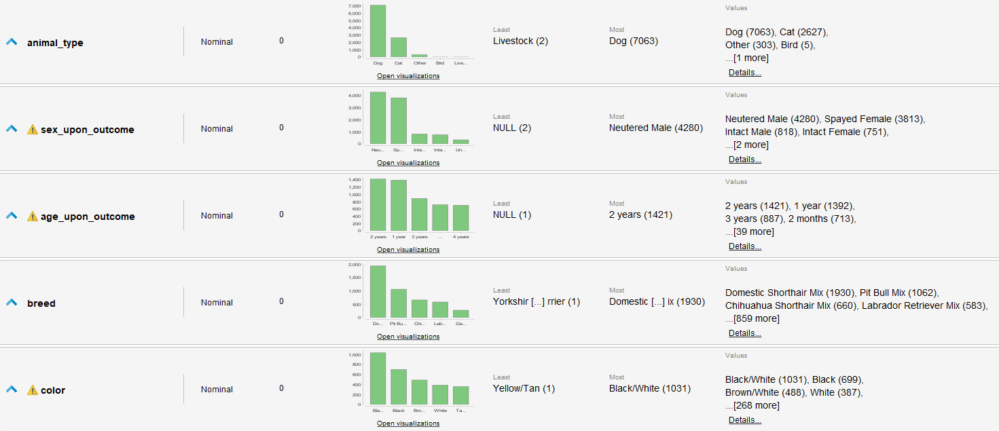  

## Transformaciones de los datos    
Se realizan los siguientes cambios y transformaciones a los datos:  
### En Intake:  
- se borra name y monthyear
- se arregla date de datetime (a tipo datetime correcto)
- age intake corregido a unicamente años (menores de 1 año quedan como 0 años)  
- age se convierte en atributo numérico  
- se divide sex a neutered y sex  
- se arreglan nulls o desconocidos mal definidos o no detectados  
- se calcula año de nacimiento de la mascota con age de llegada y fecha de llegada  

### En Outcome:  
- se cambia datetime a datetime-left para diferenciarlo del set Intakes  
- se borra name y monthyear
- se arregla date de datetime (a tipo datetime correcto)
- age intake corregido a unicamente años (menores de 1 año quedan como 0 años)  
- age se convierte en atributo numérico  
- se divide sex a neutered y sex  
- se arreglan nulls o desconocidos mal definidos o no detectados  
- se define columna adopted en base a outcome_type y subtype como binomial para saber si la mascota fue adoptada o no  

### Por último:  
- Se unen ambos sets en un único set. Se realiza un Left Join tipo Intake -> Outcome para mantener las mascotas que aún no tienen hogar.  
- Se calcula la ultima edad conocida, este atributo es igual a la edad a la que la mascota se fue, y si no se fue es la edad actual de la misma.  
- Se remueven atributos demasiado correlacionados con la salida (los específicos de la tabla outcomes)  

> Todo esto se realiza con bastante facilidad en el turbo prep de Rapidminer, permitiéndonos generar un nuevo csv con los datos transformados y generados.  

### Resulta el siguiente Dataset:  
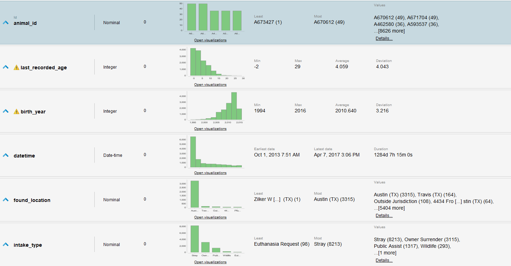  
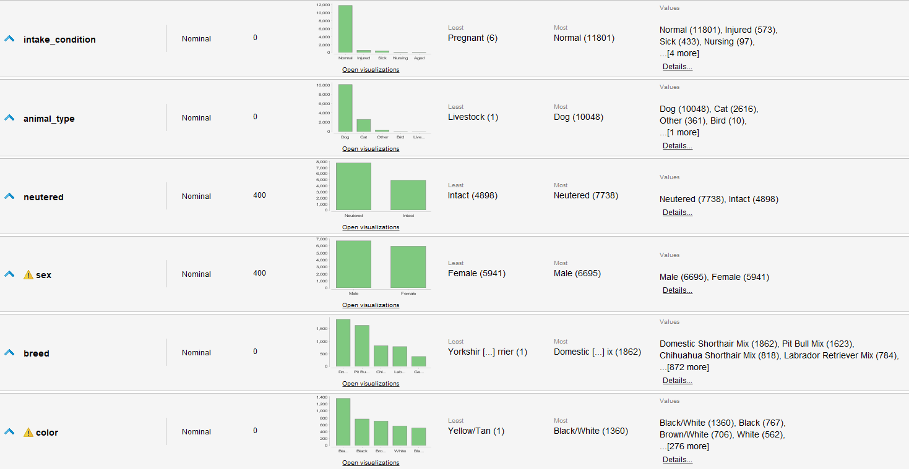  
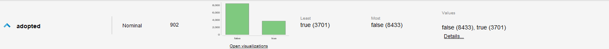  

**Notas:**  
- Se denota un desbalance importante a mascotas que no fueron adoptadas sobre las que sí  
- Se dejan varios atributos a pesar de tal vez no su obvia necesidad para contar con ellos para procesos de selección de atributos  
- Se denota una mayoría muy alta de perros en el refugio.  
 

## Modelos a Utilizarse  
Para el presente trabajo contamos con unos pocos datos numéricos, varios categóricos y un ejercicio de clasificación binomial, por lo que optamos por el uso de **Naive Bayes y Regresión Logística**.  
Para ambos de estos debemos normalizar los valores numéricos, decidir que hacer con valores faltantes y utilizar metodologías de ingeniería de atributos o algoritmos para asegurar el mejor performance posible.  
Similarmente, dado el desbalance de varios de los atributos se decide utilizar SMOTE Upsampling para balancear los atributos, especialmente nuestro atributo objetivo "adopted".  
Estos modelos los utilizaremos en 3 contextos diferentes:  
- Utilizando Selección de Atributos Evolutivo  
    - Con y sin filtrado de atributos previo    
- Utilizando Upsampling      
- No Utilizando Upsampling      

## Decisiones de modelado  
- Se decidió controlar en Algoritmo Evolutivo ya que por si solo utilizaba atributos no representativos de la realidad esperable y se sospecha sobre-ajuste.  
- Los valores faltantes son pocos, por lo que se decide eliminarlos para tener el espacio de entrenamiento más limpio posible.  

## Selección de Atributos  
**Se eliminan por correlación al objetivo los atributos:**  
- age_upon_outcome_1  
- current_age  
- date_of_birth  
- datetime_left  
- outcome_subtype  
- outcome_type  

**Se omiten los siguientes atributos debido a su poca importancia a la hora de elegir una mascota o por ya estar representado en otro atributo:**  
- age_upon_intake_1  
- animal_id  
- datetime  
- found_location  

## Proceso Final  
Resulta del trabajo previo los siguientes procesos:  
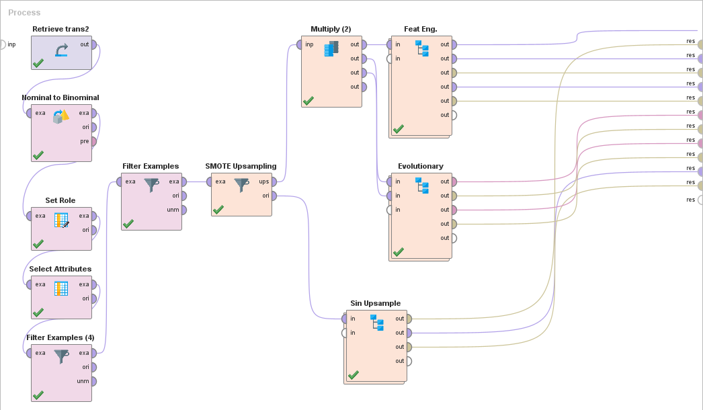  
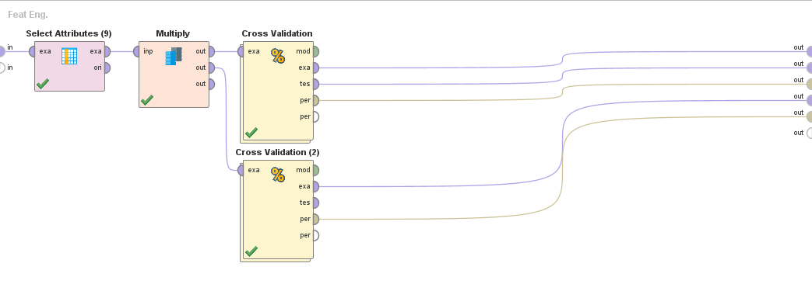   
*Los atributos seleccionados son:*  
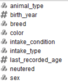  
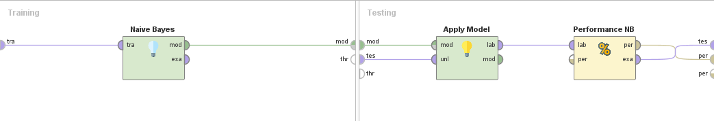  
> Los cross validation son iguales para todos los algoritmos y contextos, con los diferentes modelos cambiados.  
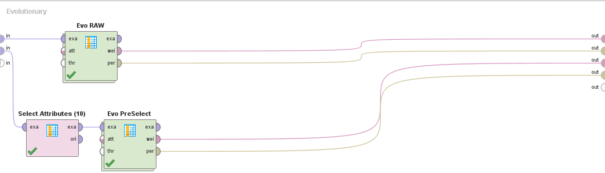  
*Los atributos pre-seleccionados son:*  
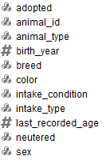  
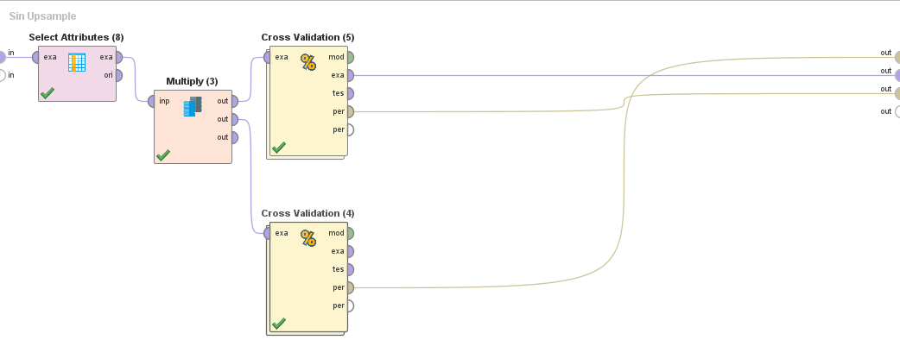  
*Los atributos seleccionados son los mismos que en el conjunto con Upsampling*  

## Desempeños  
### Ingeniería de Atributos  
- Con Upsampling, Naive Bayes  
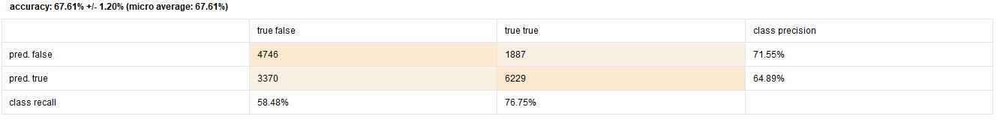  
- Con Upsampling, Regresión Logística  
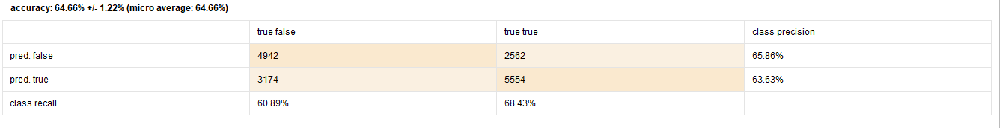  
- Sin Upsampling, Naive Bayes  
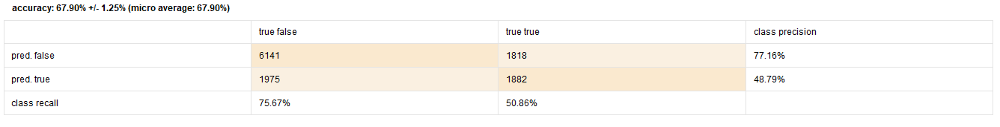  
- Sin Upsampling, Regresión Logística  
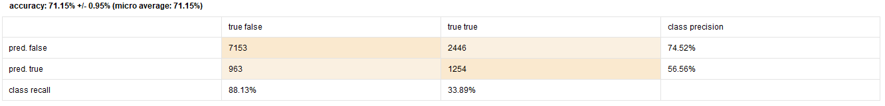  

### Selección Evolutiva  
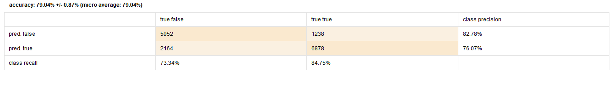  
Con los atributos:
- found_location  
- intake_type  
- intake_condition  

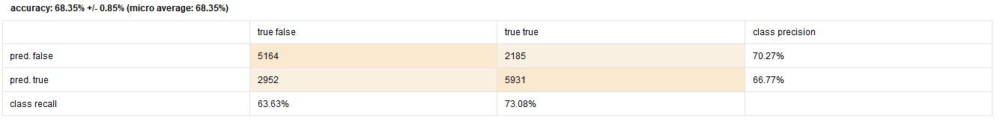  
Con los atributos:
- last_recorded_age  
- intake_type  
- intake_condition  
- animal_type  
- neutered  
- breed  
- color  

## Conclusiones y Observaciones  
- A nivel general se logran performances relativamente buenos, superando adivinar aleatoriamente, no obstante debemos notar algunas particularidades de algunos de los resultados:  
    - El mejor a nivel de porcentaje es Naive Bayes con selección evolutiva sin preselección de atributos pero juzgando por el reducido numero de atributos que usa, las distribuciones de estos y sus puntajes probablemente se trate de sobre-ajuste sobre los datos de entrenamiento y no sea realista.  
    - El siguiente mejor es regresión logística sin Upsampling. Lo llamativo de este resultado es la diferencia de precisión a predecir entre los valores posibles de adopted. Se denota una precisión de ~75% para el falso y un ~56% para los verdaderos. Esto da un promedio mayor que los otros pero expone el desbalance de falsos en los datos base.  
    - Finalmente definimos como el modelo más efectivo Naive Bayes con Upsampling, ya que tiene indices de precisión parejos y mayores entre verdaderos y falsos y una precisión general de ~67%.  
    - Como cercano podríamos poner la regresión logística con Upsampling o el modelo evolutivo con pre selección. Se opta por el primero ya que se confía más en la selección razonada que la calculada basada en los datos que se tienen unicamente.  
- La herramienta de Rapidminer de Turbo Prep es sumamente buena para generar y modificar columnas como manipular data sets, pero tiene un costo de recursos enlentecimientos considerables con sets grandes, por lo que si el equipo que se usa no lo puede soportar no es viable y se debe hacer por otro medio.  
- La ingeniería de atributos es una parte importante del proceso de modelado de Machine Learning. Sea para seleccionar atributos influyentes en el resultado buscado o para la limpieza y generación de datos nuevos pero más jugosos. La preparación de datos aba5rca la mayor parte del proceso de Machine Learning, y la ingeniería de atributos es su desarrollo exhaustivo.    
- Independiente de cualquier conclusión que pueda sacar cualquier modelo de machine learning, visto aquí o no, la probabilidad de un ser vivo a ser adoptado no puede ser reducido a mera estadística y tomar decisiones sobre la vida del mismo al respecto. **Ningún animal debe ser sacrificado o desechado como producto de cualquier predicción hecha y debe dársele a los animales rescatados todas las oportunidades de llegar a su casa permanente y vivir una vida digna.**  

