Title: Investigación de Caso: Sufrir Enfermedad Renal
Date: 2023-10-14
Category: 2. Investigación y Análisis

### de UCI Dataset [Chronic Kidney Disease](https://archive.ics.uci.edu/dataset/336/chronic+kidney+disease)  

## Introducción  
Este caso presenta un problema de clasificación, donde buscamos predecir si una persona padece una enfermedad crónica de los riñones a partir una serie amplia de datos de salud de las personas. Este ejercicio plantea un desafío de investigación importante, ya que el set y la publicación cuentan con muy poco contexto o información extra del problema, por lo que debemos asesorarnos nosotros mismos.  

## Comprensión del problema (García G. 2014)  
La detección temprana de enfermedades renales es esencial para lograr un tratamiento exitoso y no severamente caro. Los síntomas son prevalentes en la población más afectadas, como mayores de 60 años, por lo que no llaman la atención. Aproximadamente 10% de la población padece una enfermedad así, y su detección temprana es esencial, por lo que un modelo de aprendizaje de estadísticas puede asistir tanto a personal medico como a la población notar los indicios y buscar los tratamientos necesarios.   

Entre síntomas o signos de enfermedades renales se destacan:  
- Hinchazón de Cara  
- Pérdida de Apetito  
- Hipertensión  
- Anemia y Debilidad  
- Molestias no especificas  
    - Como dolores, comezón, crecimiento tardío, baja estatura, entre otros.  
- Molestias Urinarias  
    - Como ardor, obstrucción o poco volumen  
- Proteínas o Sangre en la orina  
- Niveles altos de Creatinina (+ de 1,4mg/dl) y Urea (+ de 40mg/dl) en sangre 
- Hemoglobina baja en sangre  
- Azúcar, proteínas sacáridas, colesterol, potasio, cloro, sodio, calcio, fósforo, bicarbonato entre otros en sangre.

Se destacan como personas de riesgo de padecer también a:
- Personas con Diabetes  
- Personas con hipertensión  0
- Personas con antecedentes familiares  
- Obesos, fumadores y/o mayores de 60 años   

> *Información tomada de García, G., Pandya, S., & Chavez, J. (2014). Guía completa para pacientes renales. Obtenido de Kidney Education Foundation: http://www.kidneyinspanish. com/chapters/ch13.php*

## Evaluación de Datos  
Se identifican 400 ejemplos con 25 atributos:  
1. Edad(Numérico)  
  	age en Años  
2. Presión Sanguínea(Numérico)  
    bp en mm/Hg  
3. Specific Gravity(Categórico)  
  	sg - (1.005,1.010,1.015,1.020,1.025)  
4. Albumin(Categórico)  
	al - (0,1,2,3,4,5)  
5. Azúcar(Categórico)  
	su - (0,1,2,3,4,5)  
6. Células Rojas(Binomial)  
	rbc - (normal,abnormal)  
7. Pus Cell (Binomial)  
	pc - (normal,abnormal)  
8. Pus Cell clumps(Binomial)  
	pcc - (present, notpresent)  
9. Bacteria(Binomial)  
	ba  - (present, notpresent)  
10. Glucosa en Sangre Random(Numérico)		  
	bgr en mgs/dl  
11. Sangre Urea(Numérico)	  
	bu en mgs/dl  
12. Serum Creatinine(Numérico)	  
	sc en mgs/dl  
13. Sodio(Numérico)  
	sod en mEq/L  
14. Potasio(Numérico)	  
	pot en mEq/L  
15. Hemoglobina (Numérico)  
	hemo en gms  
16. Packed  Cell Volume(Numérico)  
17. Células Blancas Cell Count(Numérico)  
	wc en cells/cumm  
18. Conteo Células Rojas(Numérico)	  
	rc en millions/cmm  
19. Hypertension (Binomial)	  
	htn - (yes,no)  
20. Diabetes Mellitus(Binomial)	  
	dm - (yes,no)  
21. Coronary Artery Disease(Binomial)  
	cad - (yes,no)  
22. Apetito (Binomial)	  
	appet - (good,poor)  
23. Pedal Edema(Binomial)  
	pe - (yes,no)	  
24. Anemia(Binomial)  
	ane - (yes,no)  
25. Class (Binomial, Objetivo)		  
	class - (ckd,notckd):  Si padece o no una enfermedad renal crónica (ckd por la sigla en inglés)

## Estadísticas de los datos sin procesar  
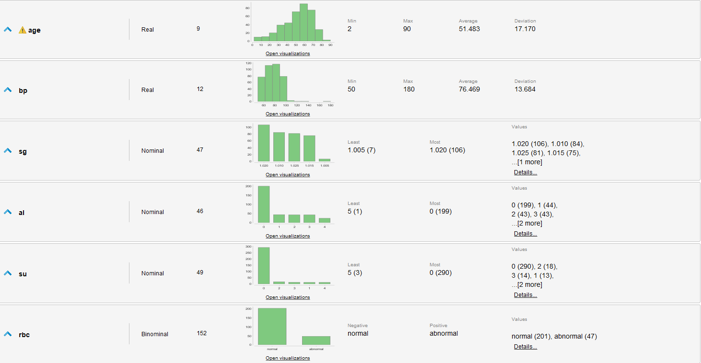  
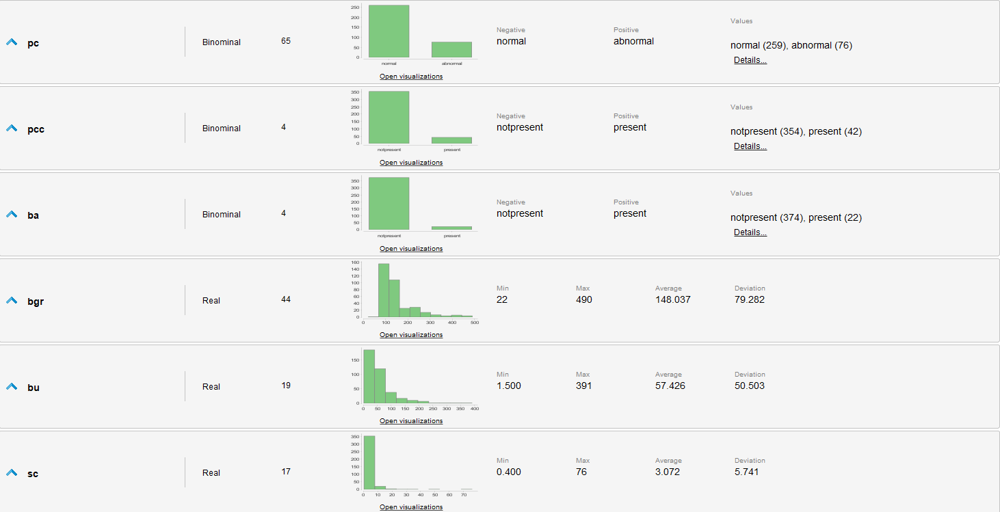  
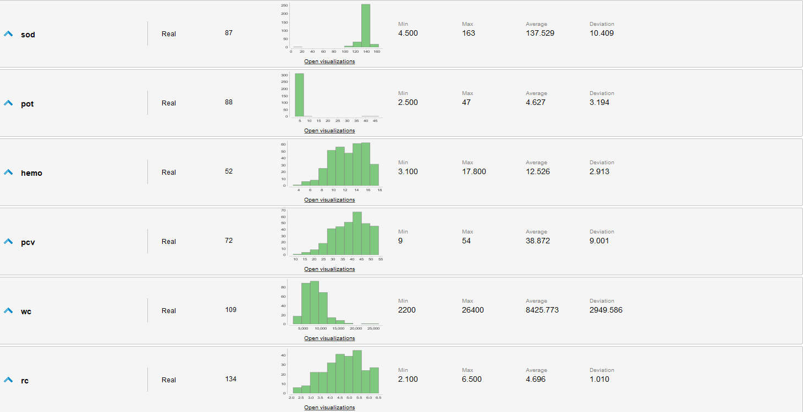  
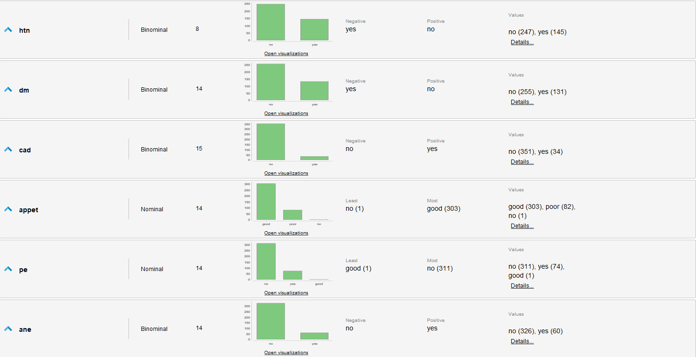  
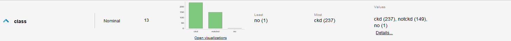  

## Evaluaciones de los datos  
- Se identifican muchos valores faltantes en varios atributos, algunos tan graves que casi la mitad de los ejemplos los carecen.  
- appet, pe y class tienen valores erróneos.  
- Los datos están levemente desbalanceados, ya que hay mas casos que padecen de una enfermedad que los que no.  
- Existen outliers en varios atributos  

## Procesado de datos
- Los datos erróneamente ingresados pueden ser computados, ya que no carecen de sentido respecto donde están ingresados, sino que son inconsistentes con los demás datos. Estos los corregimos.   
- Debido a la gran cantidad de datos faltantes, no podemos simplemente eliminarlos del dataset pues perderíamos mucha información, se decide sustituirlos por los valores promedio del atributo para mantener las proporciones de los datos.  
- Los outliers los podemos ver en box-plots, y podemos eliminarlos. Se eliminan hasta 10 ejemplos.  
- Basándonos exclusivamente en la documentación, reducimos a los siguientes atributos como los más relevantes:  
	- appet(cat), htn(cat), bp, rc, rbc(cat), hemo, ane(cat), bu, sc, su(cat), dm(cat), pot, sod, age  
- Se decide omitir el atributo de edad, ya que la documentación denuncia un sesgo a la detección de la enfermedad en gente de mayor edad. Para evitar reproducir este sesgo en el modelo lo omitimos.  
- Los datos numéricos son normalizados debido a la variedad de unidades y rangos entre los datos.  
- Como prevención de nuestro razonamiento, también se utilizarán algoritmos de selección de atributos

## Modelos a utilizarse  
Debido a la naturaleza de calificación del problema, se deciden probar 3 modelos: Regresión Logística, Naive Bayes y K-NN.
Todos estos toleran la calificación binomial que buscamos, la diferencia es su tolerancia a los datos polinomiales. Mientras que la regresión logística puede aprovechar estos datos, K-NN no los puede aprovechar ya que los valores polinomiales suelen ser difíciles de calcular distancias, ademas de que asumen una cualidad ordinal de los valores posibles. Para cada modelo serán levemente diferentes la preparación, pero los dos requieren normalización de los datos y limpieza de ruido y outliers.  

## Procesos Formulados  
**Proceso General:**  
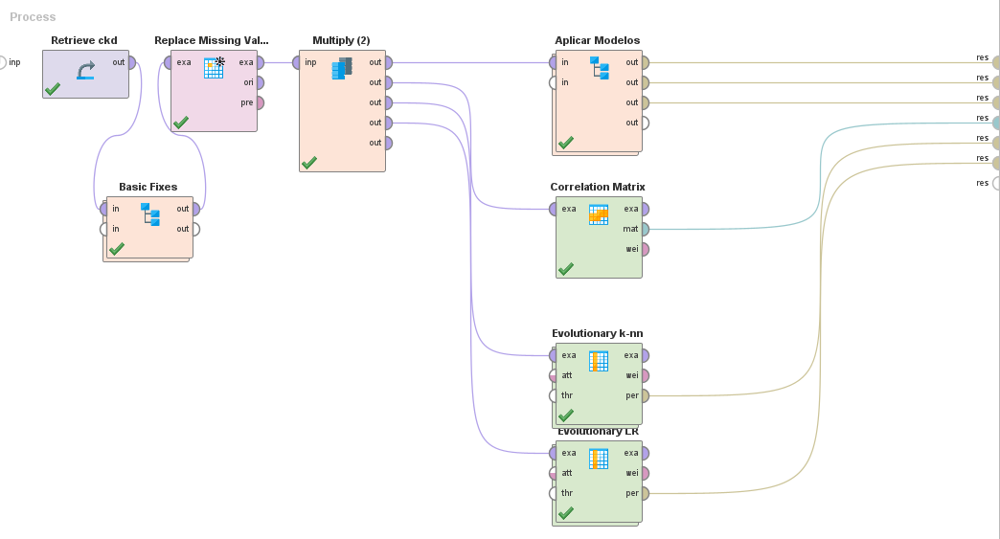  

**Basic Fixes:**  
Aquí se realizan los arreglos mencionados previamente, específicamente los errores de tipeo, rellenado de valores faltantes y eliminación de outliers. Las normalizaciones se realizan luego en las cross validation para evitar el leak de resultados en el testing.   
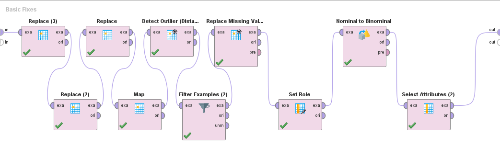  

**Aplicar Modelos:**  
Aquí creamos y probamos nuestros modelos con cross validation (10 folds). También seleccionamos los atributos óptimos para cada algoritmo que utilizamos.  
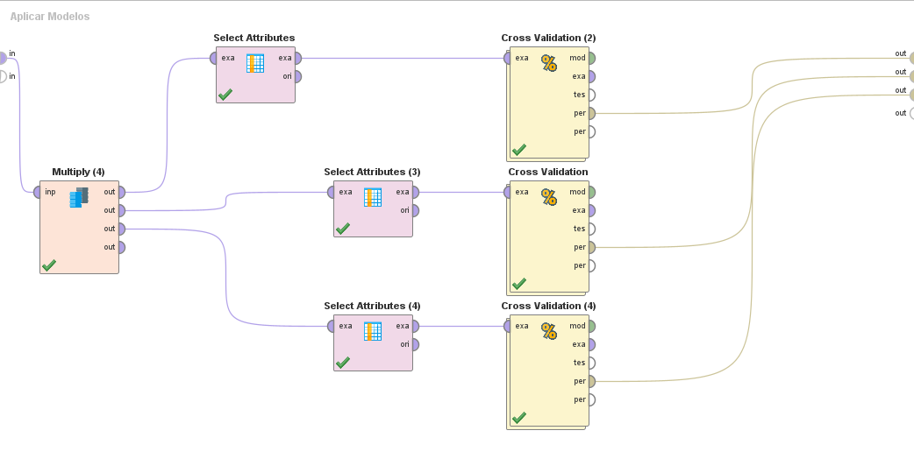   
Internamente todos los cross validation son análogos, con los diferentes algoritmos.  
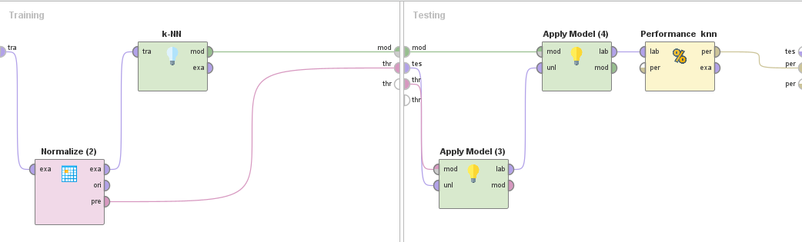  

> De la misma estructura son los cross validation que se utilizan para la aplicación de la selección de atributos evolutiva.  

## Resultados  
### Atributos resultantes de la selección evolutiva:  
**LR:**  
- appet  
- sg  
- ba  
- sod  
- pcv  
- htn  

**K-NN:**  
- pe  
- appet  
- sg  
- al  
- rbc  
- pc  
- ba  
- sc  
- pcv  
- rc  
- htn  
- cad  
- ane  

### Matriz de Correlación:  
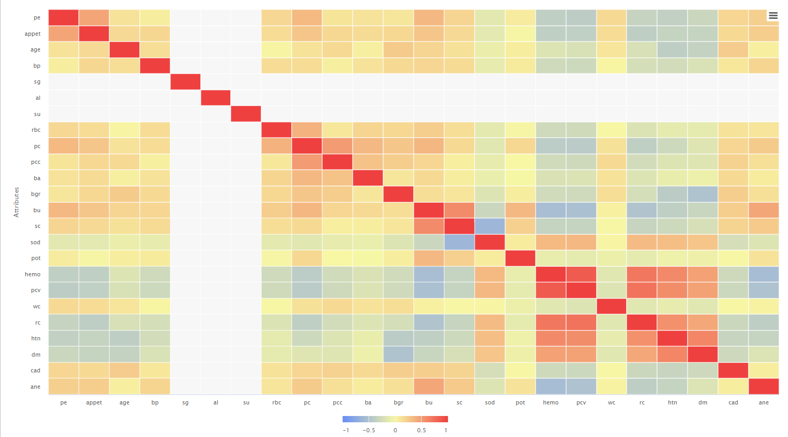  

### Puntajes de Precisión:  
**Naive Bayes:**  
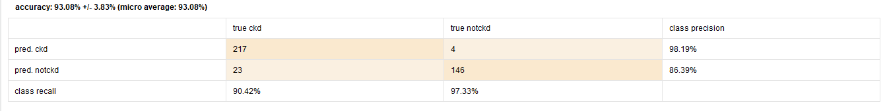  

**K-NN:**  
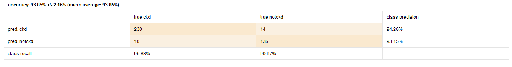  

**Regresión Logística:**  
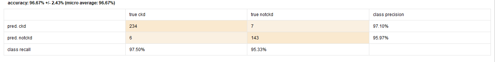  

**K-NN Evolutiva:**  
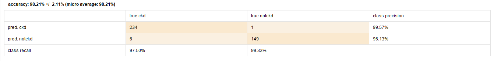  

**RL Evolutiva:**  
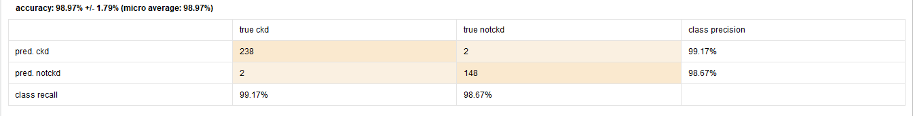  

## Conclusiones y Comentarios  
- Todos los algoritmos cuentan con un performance sumamente bueno, pero esto puede ser producto de sobre-ajuste provocado por nuestro rellenado de atributos faltantes o por el sesgo de los atributos. Esto es especialmente notorio en los algoritmos cuyos atributos fueron seleccionados por la selección evolutiva, ya que estos no reflejan los argumentos planteados en la documentación citada durante la investigación del problema.  
- De todas formas, los algoritmos prueban ser muy buenos dado el contexto favorable planteado por el problema, pudiendo aprovechar bien el valor de cada dato. Su validez no debe ser tomada de forma indiscriminada y debe ser juzgado por datos diferentes externos al grupo de entrenamiento para comprobar si existe realmente un sobre-ajuste.  
- Este caso permitió al equipo no solo realizar un trabajo de datos importante y completo, sino también la parte de investigación más completa presenta un aprendizaje importante. Cuidar la salud renal no es poca cosa.  