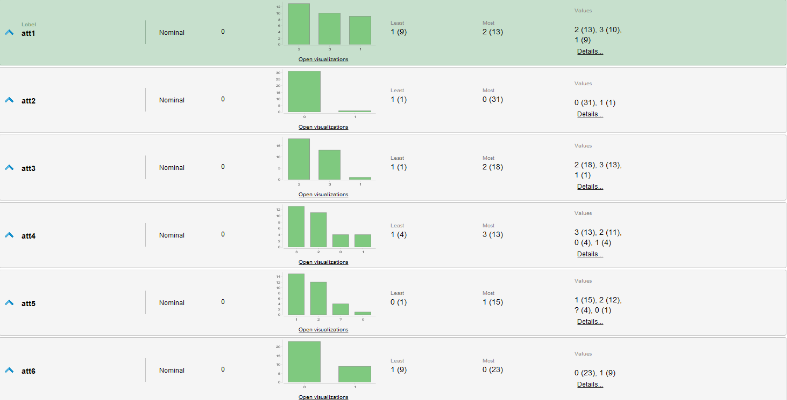
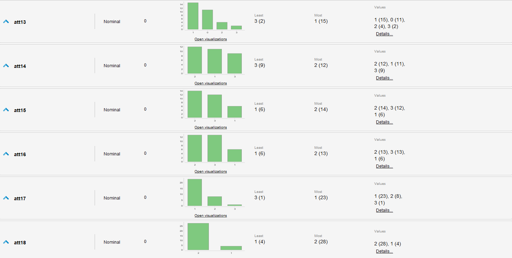
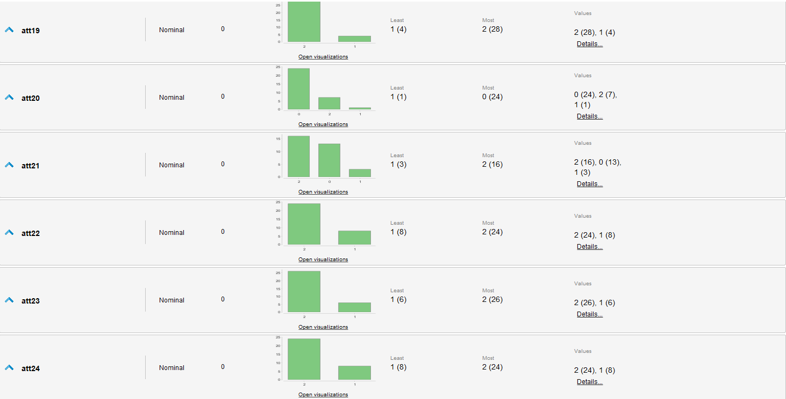
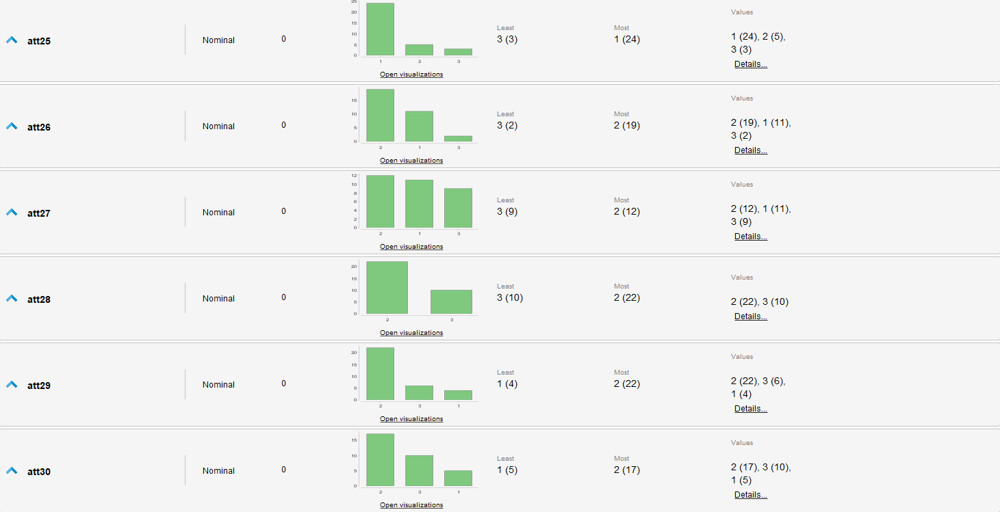
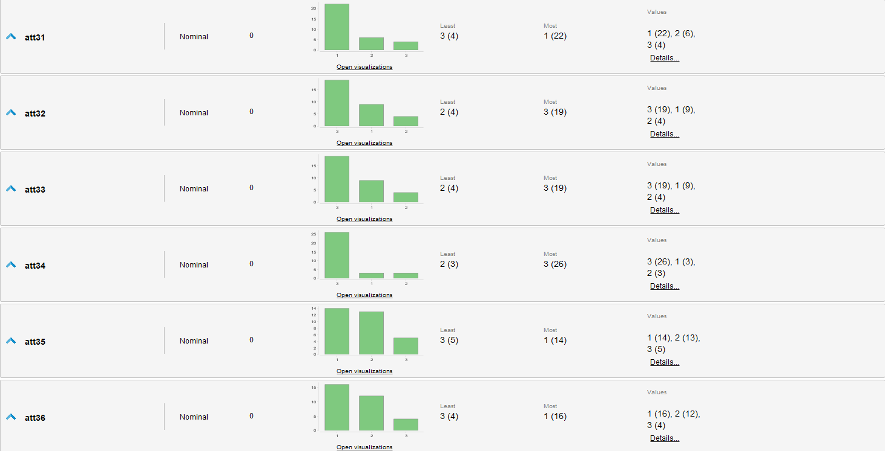
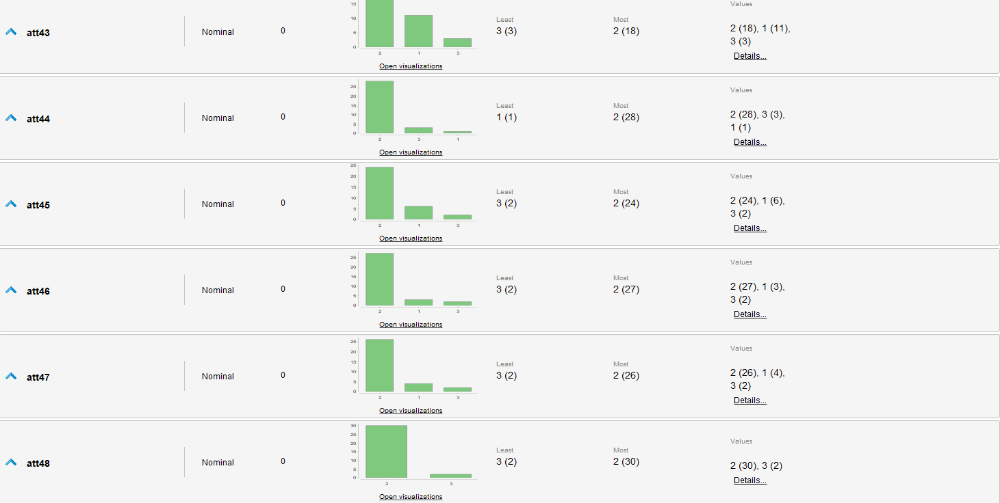
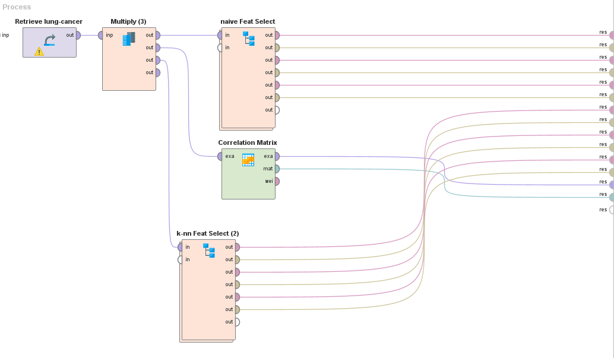
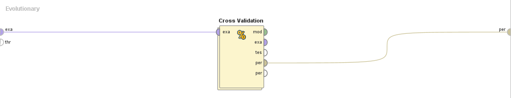
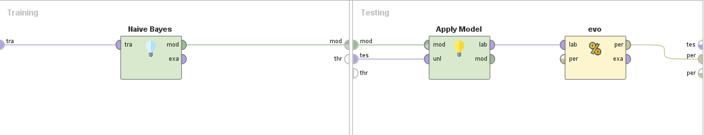

Title: Investigación Caso: Cáncer de Pulmón
Date: 2023-10-11
Category: 2. Investigación y Análisis

### de UCI Dataset: [Lung Cancer](https:/archive.ics.uci.edu/dataset/62/lung+cancer)  

## Introducción
Este caso plantea un problema particular, al contarse con muy poca información respecto el contexto y significado de los datos, el amplio numero de atributos y los desbalanceos en los datos de cada atributo. Este ejercicio de clasificación presenta el problema de identificar entre 3 tipos de Cancer de Pulmón a partir de un conjunto reducido de datos pero con muchos atributos.  

## Resumen y Estadísticas del Set  

<table>
  <tr>
    <th><strong>Característica</strong>  </th>
    <th><strong>Descripción</strong>  </th>
  </tr>
  <tr>
    <td>Cant. de Ejemplos  </td>
    <td>32  </td>
  </tr>
  <tr>
    <td>Cant. de Atributos  </td>
    <td>56  </td>
  </tr>
  <tr>
    <td>Tipo Ejercicio  </td>
    <td>Clasificación  </td>
  </tr>
  <tr>
    <td>Variable Objetivo  </td>
    <td>att1: Tipo categórico (1 al 3)  </td>
  </tr>
  <tr>
    <td>Tipos Atributos  </td>
    <td>Todos los atributos son categóricos, con valores entre 0 y 3  </td>
  </tr>
</table>

**Estadísticas**  
  

## Revisión de Datos  
En esta sección elaboraríamos en el significado, implicancias y características de los datos en el contexto del problema, pero para este caso no contamos con la información específica para estos datos.  
Resaltamos únicamente que todos los datos son categóricos y aunque tengan valores numéricos no podemos asumir naturaleza ordinal de estos. Similarmente en varios atributos se resaltan cantidades dispares de las diferentes categorías de cada uno.  

## Procesamiento de Datos  
El procesamiento de datos es complejo ya que no tenemos el contexto para discernir de manera racional que atributos aportan o no a la predicción que buscamos hacer, por lo que debemos soportarnos por heurísticas y estadísticas de los datos de por sí. Para el presente caso evaluaremos las diferencias de performance dadas las heurísticas más usadas: Forward Selection, Backward Selection y Evolutionary Selection.  
Por otro lado, hay 5 ejemplos con valores faltantes. Normalmente este es un numero insignificante pero dado el reducido numero de ejemplos disponibles decidimos tolerarlos y no eliminarlos. En algunos casos los algoritmos de Feature Selection omiten los atributos que contienen estos valores faltantes (att5 y att39), por lo que el impacto no es muy grave.  

## Elección de Modelo  
Para el presente ejercicio nos planteamos 2 modelos como pretendientes: Naive Bayes y K-NN.  
Ambos son buenos algoritmos de clasificación. Elegimos Naive Bayes ya que se especializa en atributos categóricos que en este caso son todos nuestros atributos. K-NN nos permite obtener un modelo performante para el conjunto de datos pequeños, aunque con este arriesgamos introducir la asunción de que nuestras variables categóricas son ordinales, debido al parseo necesario y el calculo de distancia entre puntos. En otros casos la cantidad de atributos sería detrimental al modelo, pero para este caso donde reducimos los atributos a los significativos no es tan fuerte la sobre-dimensionalidad.  

## Definición de proceso de entrenamiento  
Para el entrenamiento utilizaremos Cross-validation de 10 folds, ya que es una bastante estándar de medir el performance de nuestros modelos y debido al poco pre-procesamiento es fácil de implementar.  
Por el lado de la Feature Selection, compararemos las heurísticas con los siguientes parámetros:  
- Forward Selection: n° máximo de atributos: 30, Criterio de Detención: Sin Mejora.  
- Backward Selection: n° máximo de eliminaciones: 10, Criterio de Detención: Sin Mejora.  
- Evolutionary Selection: Población: 9, n° máx de generaciones: 30, n° mínimo de atributos: 1.  

## Procesos  
  
Subproceso "naive Feat Select":  
  
Subproceso "Evolutionary":  
  
Subproceso "Cross Validation":  
  

*Es análogo para las otras heurísticas y modelo, solo se sustituye el bloque correspondiente*  

## Performance  
### Naive Bayes  
#### Forward Selection  
Atributos Seleccionados:  
att20, att21, att24, att54   
Total: 4  

PerformanceVector:
- accuracy: 81.67% +/- 25.40% (micro average: 81.25%)  

ConfusionMatrix:  
<table>
  <tr>
    <th>  </th>
    <th>True: 1  </th>
    <th>True: 2  </th>
    <th>True: 3  </th>
  </tr>
  <tr>
    <td>1:  </td>
    <td>8  </td>
    <td>2  </td>
    <td>0  </td>
  </tr>
  <tr>
    <td>2:  </td>
    <td>1  </td>
    <td>10  </td>
    <td>2  </td>
  </tr>
  <tr>
    <td>3:  </td>
    <td>0  </td>
    <td>1  </td>
    <td>8  </td>
  </tr>
</table>

#### Backward Selection  
Atributos Seleccionados:  
att2, att3, att5, att7, att8, att9, att11, att12, att13, att14, att15, att17, att18, att19, att20, att21, att22, att24, att25, att26, att27, att28, att29, att30, att31, att32, att33, att34, att36, att37, att38, att39, att40, att41, att42, att43, att44, att45, att46, att47, att48, att49, att51, att52, att53, att54, att55, att57   
Total: 48   

PerformanceVector:  
accuracy: 75.83% +/- 28.45% (micro average: 75.00%)  

ConfusionMatrix:  
<table>
  <tr>
    <th>True:  </th>
    <th>1  </th>
    <th>2  </th>
    <th>3  </th>
  </tr>
  <tr>
    <td>1:  </td>
    <td>8  </td>
    <td>2  </td>
    <td>0  </td>
  </tr>
  <tr>
    <td>2:  </td>
    <td>1  </td>
    <td>9  </td>
    <td>3  </td>
  </tr>
  <tr>
    <td>3:  </td>
    <td>0  </td>
    <td>2  </td>
    <td>7  </td>
  </tr>
</table>  

#### Evolutionary Selection  
Atributos Seleccionados:  
att2, att3, att6, att7, att9, att11, att14, att17, att19, att20, att22, att24, att26, att29, att30, att32, att34, att36, att37, att39, att42, att44, att47, att48, att49, att53, att54, att55, att57   
Total: 29 atributos  

PerformanceVector:  
accuracy: 84.17% +/- 16.87% (micro average: 84.38%)   

ConfusionMatrix:  
<table>
  <tr>
    <th>True:  </th>
    <th>1  </th>
    <th>2  </th>
    <th>3  </th>
  </tr>
  <tr>
    <td>1:  </td>
    <td>8  </td>
    <td>1  </td>
    <td>0  </td>
  </tr>
  <tr>
    <td>2:  </td>
    <td>1  </td>
    <td>11  </td>
    <td>2  </td>
  </tr>
  <tr>
    <td>3:  </td>
    <td>0  </td>
    <td>1  </td>
    <td>8  </td>
  </tr>
</table>  

### K-NN  
#### Forward Selection  
Atributos Seleccionados:  
att7, att41  
Total: 2  

PerformanceVector:  
accuracy: 67.50% +/- 26.77% (micro average: 65.62%)  
ConfusionMatrix:  
<table>
  <tr>
    <th>True:  </th>
    <th>1  </th>
    <th>2  </th>
    <th>3  </th>
  </tr>
  <tr>
    <td>1:  </td>
    <td>8  </td>
    <td>3  </td>
    <td>1  </td>
  </tr>
  <tr>
    <td>2:  </td>
    <td>1  </td>
    <td>10  </td>
    <td>6  </td>
  </tr>
  <tr>
    <td>3:  </td>
    <td>0  </td>
    <td>0  </td>
    <td>3  </td>
  </tr>
</table>  

#### Backward Selection  
Atributos Seleccionados:  
att3, att4, att5, att7, att8, att9, att10, att11, att13, att14, att16, att17, att18, att19, att20, att21, att22, att23, att24, att25, att26, att27, att28, att29, att30, att31, att32, att33, att34, att35, att36, att37, att38, att39, att40, att41, att42, att43, att44, att45, att46, att47, att48, att49, att50, att51, att52, att53, att54, att55, att56   
Total: 51 

PerformanceVector:  
accuracy: 63.33% +/- 34.29% (micro average: 62.50%)  
ConfusionMatrix:  
<table>
  <tr>
    <th>True:  </th>
    <th>1  </th>
    <th>2  </th>
    <th>3  </th>
  </tr>
  <tr>
    <td>1:  </td>
    <td>7  </td>
    <td>2  </td>
    <td>1  </td>
  </tr>
  <tr>
    <td>2:  </td>
    <td>1  </td>
    <td>9  </td>
    <td>5  </td>
  </tr>
  <tr>
    <td>3:  </td>
    <td>1  </td>
    <td>2  </td>
    <td>4  </td>
  </tr>
</table>  

#### Evolutionary Selection  
Atributos Seleccionados:  
att2, att3, att6, att8, att9, att11, att14, att17, att19, att20, att24, att30, att33, att34, att35, att36, att38, att40, att42, att46, att53, att54, att55, att56, att57   
Total: 25   

PerformanceVector:  
accuracy: 73.33% +/- 25.09% (micro average: 71.88%)  
ConfusionMatrix:  
<table>
  <tr>
    <th>True:  </th>
    <th>1  </th>
    <th>2  </th>
    <th>3  </th>
  </tr>
  <tr>
    <td>1:  </td>
    <td>6  </td>
    <td>3  </td>
    <td>0  </td>
  </tr>
  <tr>
    <td>2:  </td>
    <td>3  </td>
    <td>10  </td>
    <td>3  </td>
  </tr>
  <tr>
    <td>3:  </td>
    <td>0  </td>
    <td>0  </td>
    <td>7  </td>
  </tr>
</table>  

## Conclusiones/Observaciones  
- Considerando una base de predicción de 33% por elección aleatoria, se lograron buenos modelos con precisiones que superan el 60%  
- Se notan en todos los modelos indices sumamente altos de error (+/- 16% hasta +/- 34%). 
    - Esto puede ser producto de la falta de expresividad y contexto de las variables. Al no poder nosotros trazarles las relaciones correctas dependemos unicamente de los conjuntos optimizados de las heurísticas, los cuales tienen mayor o menor éxito.
- Los Forward Selection tienden a usar muy pocos atributos, mientras que Backward tiende a utilizar todos. Evolutionary suele ser más balanceado.  
- El modelo mejor adaptado es Naive Bayes utilizando Evolutionary Selection con una precisión de 84.17% +/- 16.87%   
    - Este modelo se acopla bien al problema caracterizado por tener todas las variables de tipo categórica, y el método de selección nos permite eliminar el grueso de atributos ruidosos y enfocarnos los más relacionados con la clasificación final.  
- El modelo peor adaptado al problema es K-NN con Backward Selection, con una precisión de 63.33% +/- 34.29%  
    - Esto puede ser dado por la dificultad del calculo de distancias para variables categóricas y debido a que la Backward Selection mantuvo casi todos los atributos, resultando en un modelo que sufre de la Maldición de la Dimensionalidad.  

