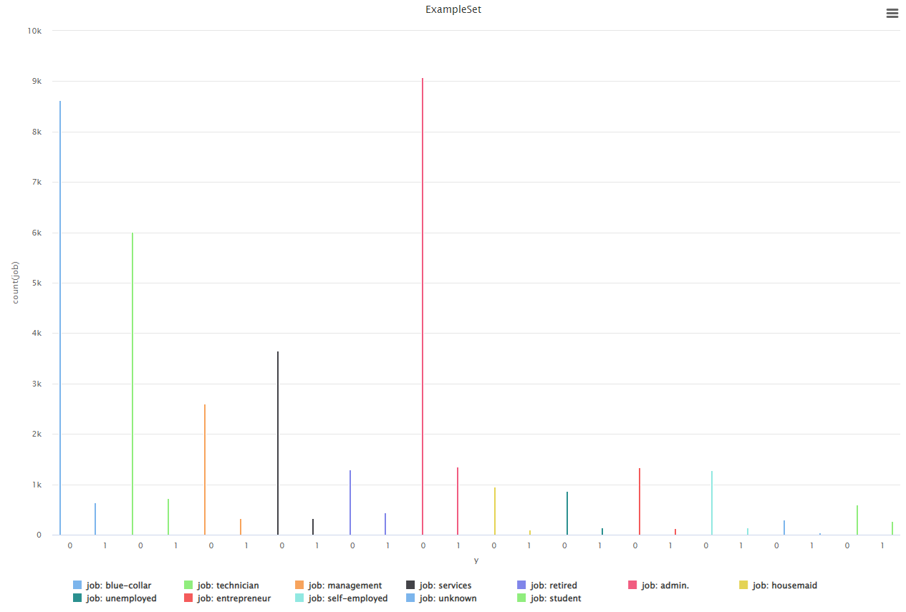

Title: Investigación Caso: Marketing Banco Portugués
Date: 2023-09-25
Category: 2. Casos de Estudio

En el presente trabajo revisaremos y desarrollaremos el caso propuesto en el dataset Bank Marketing de UCI, que se puede hallar [aquí](https://archive.ics.uci.edu/dataset/222/bank+marketing)

## Introducción al Caso  
### Contexto  
Una institución bancaria de Portugal registra el desempeño de una campaña de marketing por teléfono, donde se registra la información del cliente, su experiencia al teléfono y si termina depositando en el banco.  
El objetivo es predecir si un cliente va a depositar.   

## Data  

- Contamos con 41.188 ejemplos, con 20 atributos.  
- A primera vista no hay valores faltantes, pero se pueden hallar varios registros con campos en "unknown", que a nivel práctico es lo mismo.  
- Se resalta la nota: *Important note:  this attribute highly affects the output target (e.g., if duration=0 then y='no'). Yet, the duration is not known before a call is performed. Also, after the end of the call y is obviously known. Thus, this input should only be included for benchmark purposes and should be discarded if the intention is to have a realistic predictive model.*. Que alerta de una correlación fuerte entre los atributos objetivo y duration. Esta información será importante al preprocesamiento de los datos.

<table>
<thead>
<tr>
    <th>Attribute Name</th><th>Role</th><th>Type</th><th>Demographic</th><th>Description</th><th>Units</th><th>Missing Values</th>
</tr>
</thead> 
<tbody><tr><td>age</td><td>Atributo</td><td>Integer</td><td>Age</td><td></td><td></td><td>false</td> </tr><tr><td>job</td><td>Atributo</td><td>Polinomial</td><td>Ocupación</td><td>Tipo de Trabajo (Polinomial: 'admin.','blue-collar','entrepreneur','housemaid','management','retired','self-employed','services','student','technician','unemployed','unknown')</td><td></td><td>false</td> </tr><tr><td>marital</td><td>Atributo</td><td>Polinomial</td><td>Estado Civil</td><td>Estado civil (Polinomial: 'divorced','married','single','unknown'; note: 'divorced' representa divorciado y viudo)</td><td></td><td>false</td> </r><tr><td>education</td><td>Atributo</td><td>Polinomial</td><td>Nivel Educativo</td><td>(Polinomial: 'basic.4y','basic.6y','basic.9y','high.school','illiterate','professional.course','university.degree','unknown')</td><td></td><td>false</td> </tr><tr><td>default</td><td>Atributo</td><td>Binary</td><td></td><td>tiene crédito en default?</td><td></td><td>false</td> </tr><tr><td>balance</td><td>Atributo</td><td>Integer</td><td></td><td>balance anual promedio</td><td>euros</td><td>false</td> </tr><tr><td>housing</td><td>Atributo</td><td>Binary</td><td></td><td>tiene préstamo hipotecario?</td><td></td><td>false</td> </tr><tr><td>loan</td><td>Atributo</td><td>Binary</td><td></td><td>tiene préstamo personal?</td><td></td><td>false</td> </tr><tr><td>contact</td><td>Atributo</td><td>Polinomial</td><td></td><td>tipo de comunicación (Polinomial: 'cellular','telephone') </td><td></td><td>true</td> </tr><tr><td>day_of_week</td><td>Atributo</td><td>Date</td><td></td><td>ultimo día de contacto de la semana</td><td></td><td>false</td> </tr><tr><td>month</td><td>Atributo</td><td>Date</td><td></td><td>mes del ultimo contacto (Polinomial: 'jan', 'feb', 'mar', ..., 'nov', 'dec')</td><td></td><td>false</td> </tr><tr><td>duration</td><td>Atributo</td><td>Integer</td><td></td><td> duración del último contacto. </td><td></td><td>false</td> </tr><tr><td>campaign</td><td>Atributo</td><td>Integer</td><td></td><td>cantidad de veces que se contacto al cliente en esta campaña ( numérico, incluye ultima llamada)</td><td></td><td>false</td> </tr><tr><td>pdays</td><td>Atributo</td><td>Integer</td><td></td><td>días desde último contacto (-1 si no se contacto)</td><td></td><td>true</td> </tr><tr><td>previous</td><td>Atributo</td><td>Integer</td><td></td><td>contactos a este cliente previo a la campaña</td><td></td><td>false</td> </tr><tr><td>poutcome</td><td>Atributo</td><td>Polinomial</td><td></td><td>resultado de campaña pasada (Polinomial: 'failure','nonexistent','success')</td><td></td><td>true</td> </tr><tr><td>y</td><td>Objetivo</td><td>Binary</td><td></td><td>Objetivo: el cliente depositó?</td><td></td><td>false</td> </tr></tbody>
</table>

#### Resumenes de RapidMiner  
  
  
  

## Análisis Preliminar de Datos  
- Los valores de Y conocidos están gravemente desbalanceados, tendiendo más al 0.  (36548 negativos, 4640 positivos).  
- Tenemos muchos atributos, y algunos de estos tienen muchos valores posibles. Deberíamos investigar como agrupar los atributos y simplificar sus valores.  
- Si planeamos utilizar regresión logística para la clasificación, debemos adaptar las distribuciones para ser más gaussianas  
- Luego de limpiar valores como Unknown, tenemos varios faltantes:  

    |**Atributo**|**Faltantes**|
    |---|---|
    |job|330|
    |marital|80|
    |education|1731|
    |default|8600|
    |housing|990|
    |loan|990|
    |**total**|12721|  

> Para los datos de varias clasificaciones, como education, podemos acortarlas reemplazando similares por una común    
> Para los datos desbalanceados de salida podemos utilizar SMOTE upsampling    

**Técnica Sober-Muestreo Sintético de Minorías** ( o SMOTE por la sigla en ingles) es un método de generar datos a partir de un conjunto desbalanceado, y asi entrenar modelos no sesgados.  
Este metodo se detalla su funcionamiento [aquí](https://www.sciencedirect.com/science/article/abs/pii/S0020025519306838), pero en términos simples genera datos a partir de las entidades vecinas de la minoría a partir de puntos medios entre los mismos. A pesar de no ser un algoritmo perfecto, y uno bastante costoso, nos permite fácilmente balancear nuestros datos.  

## Análisis de Atributos  
Procedemos a plantear algunass relaciones de los atributos con nuestra variable objetiva, para discernir cuales nos sirves, cuales no y si la relación amerita un modelo lineal.

  
Vemos una forma similar en las edades y el éxito de las campañas (aparte de la diferencia numérica de casos). Ambos en media rondan los 40 maños de edad.  
  
Vemos algunos trabajos con diferencias más pronunciadas entre éxito y fracaso.  
  

## Entrenamiento y Aplicación de Modelo  
Utilizando filtrados, limpiezas y upsampling con 5 vecinos logramos el siguiente resultado del modelo.  

  
*Cabe destacar que el entrenamiento y upsampling para alrededor de 40k ejemplos tomó varios minutos

Utilizando Cross Validation (x10) obtenemos resultados similares, pero más confiables.  
  

## Conclusiones  
- Se logró un modelo bueno que predice correctamente sustancialmente mejor que adivinación estadística  
- Se logró un modelo con predicciones justas entre las clases resultantes a pesar de tener datos desbalanceados  
- Se investigaron maneras de solventar la falta de datos o el desbalance de estos, aunque lleva un costo computacional muy alto.  
- Hay espacio para mejora en el área de manipulación de datos. Las distribuciones de los mismos se puede mejorar para el algoritmo utilizado (aunque sacrificando su expresividad) y se podrían aplicar métodos de reducción o selección de atributos para mejorar el desempeño del algoritmo y reducir su coste computacional.  
