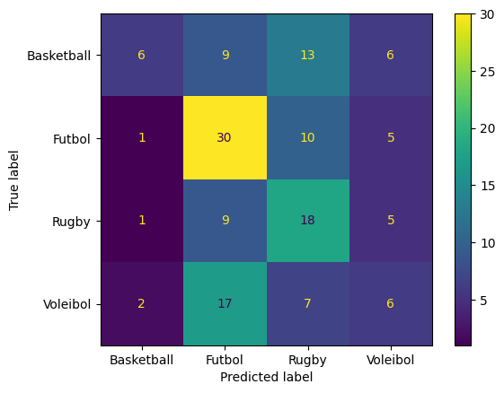
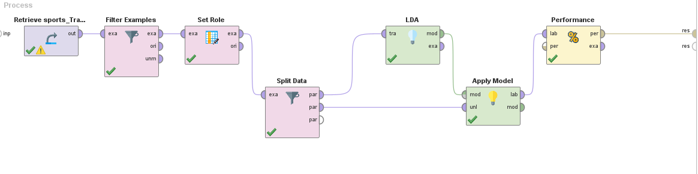
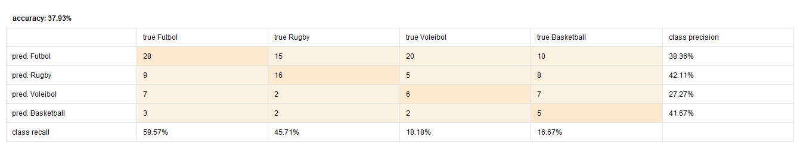
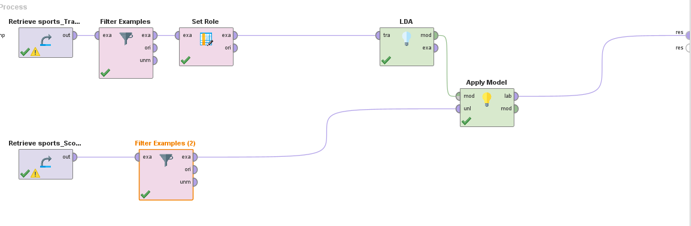
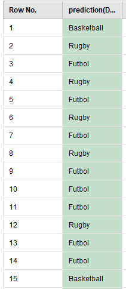
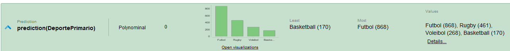

Title: Investigación Caso: Academia de Deportistas
Date: 2023-09-25
Category: 2. Casos de Estudio

## Contexto  
El “Maestro”, convencido de su capacidad para vislumbrar estrellas deportivas, ha puesto una
academia para ayudar a jóvenes deportistas a lograr su mayor desempeño. En esta academia, el
Maestro se enfoca particularmente en cuatro deportes: Fútbol, Basketball, Voleibol y Rugby.
Si bien ha visto que la mayoría de atletas jóvenes disfrutan practicando varios deportes, más
adelante podrían preferir especializarse en uno en particular.  
Al haber trabajado con atletas por muchos años, el Maestro ha ido recolectando un extenso
conjunto de datos, y se pregunta ahora si sería posible sacar provecho a toda esa información
para predecir el deporte más apropiado para los nuevos atletas. Él desearía poder recomendar a
estos atletas el deporte en que tendrían mayor éxito si se especializaran en él. 

## Análisis preliminar de Datos  

|**Atributo**|**Tipo**|**Descripción**|
|---|---|---|
|Edad|integer|Edad del deportista|
|Fuerza|integer|En base a ejercicios, en un rango del 0 al 10. Los resultados están entre 0 y 8|
|Velocidad|integer|En base a un test, en un rango del 0 al 6|
|Lesiones|Binomial|Si sufrió una lesión grave|
|Visión|integer|En base a tests, en un rango del 0 al 4. Los resultados están entre 0 y 3|
|Resistencia|integer|En base a ejercicios, en un rango de 0 a 10. Los resultados están entre 0 y 6|
|Agilidad|integer|En base a pruebas, en un rango de 0 a 100. Los resultados están entre 13 y 80|
|Capacidad Decisión|integer|En base a simulaciones, en un rango del 0 al 100. Los resultados válidos son entre 3 y 100|
|Deporte Primario (var objetivo)|polinomial|Deporte que el atleta está mejor calificado a participar (fútbol, voleibol, rugby o basketball)|

## Tratamiento de Datos  
- Sabemos que el campo Capacidad Decisión tiene valores errados, los cuales debemos corregir. Al ser proporcionalmente pocos, los podemos eliminar.  
- Hay atributos cuyos dominios no están representados completamente por los datos, por lo que se puede subentrenar para datos fuera de lo que contamos.  

## Procedimiento en Python  
Primero importamos librerías y cargamos los dataset.  


```python
import matplotlib
import matplotlib.pyplot as plt
import pandas as pd
import numpy as np
from sklearn.discriminant_analysis import LinearDiscriminantAnalysis
from sklearn.linear_model import LogisticRegression
from sklearn.metrics import ConfusionMatrixDisplay, classification_report
from sklearn.model_selection import train_test_split

input_file1 = "sports_Scoring.csv"
input_file2 = "sports_Training.csv"
dfScoring = pd.read_csv(input_file1, header=0)
dfTrain = pd.read_csv(input_file2, header=0)
dfTrain.sample(n=5)
```


<div>
<style scoped>
    .dataframe tbody tr th:only-of-type {
        vertical-align: middle;
    }

    .dataframe tbody tr th {
        vertical-align: top;
    }

    .dataframe thead th {
        text-align: right;
    }
</style>
<table border="1" class="dataframe">
  <thead>
    <tr style="text-align: right;">
      <th></th>
      <th>Edad</th>
      <th>Fuerza</th>
      <th>Velocidad</th>
      <th>Lesiones</th>
      <th>Vision</th>
      <th>Resistencia</th>
      <th>Agilidad</th>
      <th>CapacidadDecision</th>
      <th>DeportePrimario</th>
    </tr>
  </thead>
  <tbody>
    <tr>
      <th>184</th>
      <td>15.8</td>
      <td>3</td>
      <td>1</td>
      <td>1</td>
      <td>3</td>
      <td>5</td>
      <td>23</td>
      <td>44</td>
      <td>Rugby</td>
    </tr>
    <tr>
      <th>160</th>
      <td>18.8</td>
      <td>7</td>
      <td>1</td>
      <td>1</td>
      <td>0</td>
      <td>3</td>
      <td>24</td>
      <td>20</td>
      <td>Voleibol</td>
    </tr>
    <tr>
      <th>272</th>
      <td>13.3</td>
      <td>3</td>
      <td>2</td>
      <td>0</td>
      <td>3</td>
      <td>5</td>
      <td>22</td>
      <td>45</td>
      <td>Voleibol</td>
    </tr>
    <tr>
      <th>431</th>
      <td>18.3</td>
      <td>4</td>
      <td>2</td>
      <td>1</td>
      <td>2</td>
      <td>5</td>
      <td>25</td>
      <td>3</td>
      <td>Voleibol</td>
    </tr>
    <tr>
      <th>131</th>
      <td>14.5</td>
      <td>5</td>
      <td>3</td>
      <td>0</td>
      <td>0</td>
      <td>1</td>
      <td>42</td>
      <td>19</td>
      <td>Futbol</td>
    </tr>
  </tbody>
</table>
</div>


```python
dfTrain.describe()
```


<div>
<style scoped>
    .dataframe tbody tr th:only-of-type {
        vertical-align: middle;
    }

    .dataframe tbody tr th {
        vertical-align: top;
    }

    .dataframe thead th {
        text-align: right;
    }
</style>
<table border="1" class="dataframe">
  <thead>
    <tr style="text-align: right;">
      <th></th>
      <th>Edad</th>
      <th>Fuerza</th>
      <th>Velocidad</th>
      <th>Lesiones</th>
      <th>Vision</th>
      <th>Resistencia</th>
      <th>Agilidad</th>
      <th>CapacidadDecision</th>
    </tr>
  </thead>
  <tbody>
    <tr>
      <th>count</th>
      <td>493.000000</td>
      <td>493.000000</td>
      <td>493.000000</td>
      <td>493.000000</td>
      <td>493.000000</td>
      <td>493.000000</td>
      <td>493.000000</td>
      <td>493.000000</td>
    </tr>
    <tr>
      <th>mean</th>
      <td>15.941785</td>
      <td>3.519270</td>
      <td>1.973631</td>
      <td>0.638945</td>
      <td>1.697769</td>
      <td>3.849899</td>
      <td>33.685598</td>
      <td>30.172414</td>
    </tr>
    <tr>
      <th>std</th>
      <td>1.808235</td>
      <td>1.464392</td>
      <td>1.499768</td>
      <td>0.480794</td>
      <td>1.133352</td>
      <td>1.330454</td>
      <td>12.446329</td>
      <td>21.484270</td>
    </tr>
    <tr>
      <th>min</th>
      <td>13.000000</td>
      <td>0.000000</td>
      <td>0.000000</td>
      <td>0.000000</td>
      <td>0.000000</td>
      <td>0.000000</td>
      <td>13.000000</td>
      <td>0.000000</td>
    </tr>
    <tr>
      <th>25%</th>
      <td>14.300000</td>
      <td>3.000000</td>
      <td>1.000000</td>
      <td>0.000000</td>
      <td>1.000000</td>
      <td>3.000000</td>
      <td>23.000000</td>
      <td>11.000000</td>
    </tr>
    <tr>
      <th>50%</th>
      <td>15.900000</td>
      <td>4.000000</td>
      <td>1.000000</td>
      <td>1.000000</td>
      <td>2.000000</td>
      <td>5.000000</td>
      <td>32.000000</td>
      <td>29.000000</td>
    </tr>
    <tr>
      <th>75%</th>
      <td>17.600000</td>
      <td>4.000000</td>
      <td>2.000000</td>
      <td>1.000000</td>
      <td>3.000000</td>
      <td>5.000000</td>
      <td>42.000000</td>
      <td>41.000000</td>
    </tr>
    <tr>
      <th>max</th>
      <td>19.000000</td>
      <td>7.000000</td>
      <td>6.000000</td>
      <td>1.000000</td>
      <td>3.000000</td>
      <td>6.000000</td>
      <td>80.000000</td>
      <td>103.000000</td>
    </tr>
  </tbody>
</table>
</div>


Tratamos los datos con lo especificado antes.  


```python
dfCleanScoring = dfScoring[(dfScoring['CapacidadDecision'] >= 3) & (dfScoring['CapacidadDecision'] <= 100)]

dfCleanTrain = dfTrain[(dfTrain['CapacidadDecision'] >= 3) & (dfTrain['CapacidadDecision'] <= 100)]

dfCleanTrain.describe()
```


<div>
<style scoped>
    .dataframe tbody tr th:only-of-type {
        vertical-align: middle;
    }

    .dataframe tbody tr th {
        vertical-align: top;
    }

    .dataframe thead th {
        text-align: right;
    }
</style>
<table border="1" class="dataframe">
  <thead>
    <tr style="text-align: right;">
      <th></th>
      <th>Edad</th>
      <th>Fuerza</th>
      <th>Velocidad</th>
      <th>Lesiones</th>
      <th>Vision</th>
      <th>Resistencia</th>
      <th>Agilidad</th>
      <th>CapacidadDecision</th>
    </tr>
  </thead>
  <tbody>
    <tr>
      <th>count</th>
      <td>482.000000</td>
      <td>482.000000</td>
      <td>482.000000</td>
      <td>482.000000</td>
      <td>482.000000</td>
      <td>482.000000</td>
      <td>482.000000</td>
      <td>482.000000</td>
    </tr>
    <tr>
      <th>mean</th>
      <td>15.954564</td>
      <td>3.500000</td>
      <td>1.983402</td>
      <td>0.639004</td>
      <td>1.692946</td>
      <td>3.856846</td>
      <td>33.680498</td>
      <td>29.157676</td>
    </tr>
    <tr>
      <th>std</th>
      <td>1.817320</td>
      <td>1.460854</td>
      <td>1.505269</td>
      <td>0.480788</td>
      <td>1.134010</td>
      <td>1.331782</td>
      <td>12.523973</td>
      <td>19.477265</td>
    </tr>
    <tr>
      <th>min</th>
      <td>13.000000</td>
      <td>0.000000</td>
      <td>0.000000</td>
      <td>0.000000</td>
      <td>0.000000</td>
      <td>0.000000</td>
      <td>13.000000</td>
      <td>3.000000</td>
    </tr>
    <tr>
      <th>25%</th>
      <td>14.300000</td>
      <td>3.000000</td>
      <td>1.000000</td>
      <td>0.000000</td>
      <td>1.000000</td>
      <td>3.000000</td>
      <td>23.000000</td>
      <td>11.000000</td>
    </tr>
    <tr>
      <th>50%</th>
      <td>15.900000</td>
      <td>4.000000</td>
      <td>1.000000</td>
      <td>1.000000</td>
      <td>2.000000</td>
      <td>5.000000</td>
      <td>31.500000</td>
      <td>29.000000</td>
    </tr>
    <tr>
      <th>75%</th>
      <td>17.600000</td>
      <td>4.000000</td>
      <td>2.000000</td>
      <td>1.000000</td>
      <td>3.000000</td>
      <td>5.000000</td>
      <td>42.750000</td>
      <td>40.000000</td>
    </tr>
    <tr>
      <th>max</th>
      <td>19.000000</td>
      <td>7.000000</td>
      <td>6.000000</td>
      <td>1.000000</td>
      <td>3.000000</td>
      <td>6.000000</td>
      <td>80.000000</td>
      <td>100.000000</td>
    </tr>
  </tbody>
</table>
</div>


Separamos las entradas de la salida y dividimos los datos para entrenar y testear.  (Sobre el set de train)


```python
X = dfCleanTrain[['Edad','Fuerza','Velocidad','Lesiones','Vision','Resistencia','Agilidad','CapacidadDecision']].values
y = dfCleanTrain['DeportePrimario'].values

train_X, test_X, train_y, test_y = train_test_split(X, y, test_size=0.3, random_state=0, shuffle=True)
```

Con los datos separados y definidos, entrenamos el modelo.


```python
lda = LinearDiscriminantAnalysis()
lda = lda.fit(train_X, train_y)
```

Y pasamos a la predicción y vemos el desempeño.  


```python
y_pred = lda.predict(test_X)
print(classification_report(test_y, y_pred, digits=3))
ConfusionMatrixDisplay.from_predictions(test_y, y_pred)
```

                  precision    recall  f1-score   support
    
      Basketball      0.600     0.176     0.273        34
          Futbol      0.462     0.652     0.541        46
           Rugby      0.375     0.545     0.444        33
        Voleibol      0.273     0.188     0.222        32
    
        accuracy                          0.414       145
       macro avg      0.427     0.390     0.370       145
    weighted avg      0.433     0.414     0.386       145
    
    


    <sklearn.metrics._plot.confusion_matrix.ConfusionMatrixDisplay at 0x2353fa68940>


    

    


## Comparación RapidMiner  
Procedemos a implementar el mismo proceso en RapidMiner para ver como se comparan los modelos que construyen.  
  
  

## Predicción  
Ahora que tenemos el modelo entrenado y validado, podemos pasar a predecir para el set de scoring.  
Para esto re-entrenamos el set con todos los datos de train que disponemos (tras limpieza), para asegurar el mejor performance posible.


```python
lda2 = LinearDiscriminantAnalysis()
lda2 = lda2.fit(dfCleanTrain[['Edad','Fuerza','Velocidad','Lesiones','Vision','Resistencia','Agilidad','CapacidadDecision']].values, dfCleanTrain['DeportePrimario'].values)

scoringPred = lda.predict(dfCleanScoring)
```

    C:\Users\gatom\AppData\Local\Packages\PythonSoftwareFoundation.Python.3.9_qbz5n2kfra8p0\LocalCache\local-packages\Python39\site-packages\sklearn\base.py:457: UserWarning: X has feature names, but LinearDiscriminantAnalysis was fitted without feature names
      warnings.warn(
    


```python
#Vemos los primeros 15 resultados de ejemplo
print(scoringPred[:16])

print("Predicciones Futbol:",np.count_nonzero(scoringPred == 'Futbol'))
print("Predicciones Voleibol:",np.count_nonzero(scoringPred == 'Voleibol'))
print("Predicciones Basketball:",np.count_nonzero(scoringPred == 'Basketball'))
print("Predicciones Rugby:",np.count_nonzero(scoringPred == 'Rugby'))
```

    ['Voleibol' 'Rugby' 'Futbol' 'Rugby' 'Rugby' 'Rugby' 'Futbol' 'Rugby'
     'Futbol' 'Voleibol' 'Futbol' 'Rugby' 'Futbol' 'Futbol' 'Basketball'
     'Voleibol']
    Predicciones Futbol: 772
    Predicciones Voleibol: 366
    Predicciones Basketball: 139
    Predicciones Rugby: 490
    

En RapidMiner resulta:  
  
  
  

# Conclusiones    
- A pesar de no tener resultados excelentes, la precisión obtenida (~40%) es sustancialmente mejor que simplemente adivinar (que tendría un 25% probabilidad de acierto)  
- En comparación a RapidMiner, SKLearn predice mejor deportes como voleibol y rugby, dándole una precisión general mayor.  
- En la aplicación de modelo, ambos dan resultados diferentes. 
- Como es esperado, el modelo de RapidMiner favorece las predicciones a fútbol, mientras que en SKLearn es más balanceado.
