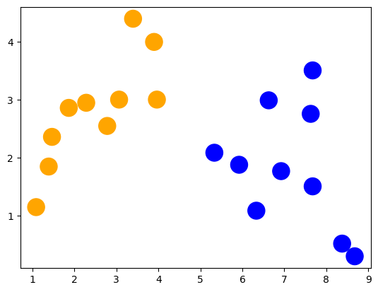
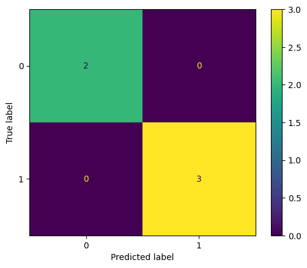

Title: Algoritmo Linear Discriminant Analysis
Date: 2023-09-25
Category: 3. Algoritmos Machine Learning

Análisis Discriminante Lineal es un algoritmo de machine learning que nos permite la clasificación multi-clase de datos, permitiendo la predicción de campos polinomiales.  

### Características del modelo:  
**Usos**: Clasificación polinómica (categórica)  
**Explicación Breve**: Utiliza probabilidades de los atributos respecto el objetivo para predecir. Usa Bayes  
**Cualidades**:  
- Se asume distribuciones gaussianas de atributos  
- Se asume misma varianza para todos los atributos   

**Preparación de Datos**:   
- Eliminar Outliers  
- Requiere una distribución normal/gaussiana en todos los atributos  
- Conviene estandarizar (para tener Media=0 y Varianza=1)  


En el presente trabajo demostraremos un proceso básico de este algoritmo en Python con SciKit Learn.  

## Análisis preliminar de Datos  
Utilizaremos un conjunto de datos reducido, con parámetros abstractos.  

|**Atributo**|**Tipo**|
|---|---|
|X|integer|
|Y|integer|
|Label (var objetivo)|polinomial|

## Procedimiento en Python  
Primero importamos librerías y cargamos el dataset.  


```python
import matplotlib
import matplotlib.pyplot as plt
import pandas as pd
from sklearn.discriminant_analysis import LinearDiscriminantAnalysis
from sklearn.linear_model import LogisticRegression
from sklearn.metrics import ConfusionMatrixDisplay, classification_report
from sklearn.model_selection import train_test_split

input_file = "sample.csv"
df = pd.read_csv(input_file, header=0)
df.sample(n=5)
```


<div>
<style scoped>
    .dataframe tbody tr th:only-of-type {
        vertical-align: middle;
    }

    .dataframe tbody tr th {
        vertical-align: top;
    }

    .dataframe thead th {
        text-align: right;
    }
</style>
<table border="1" class="dataframe">
  <thead>
    <tr style="text-align: right;">
      <th></th>
      <th>x</th>
      <th>y</th>
      <th>label</th>
    </tr>
  </thead>
  <tbody>
    <tr>
      <th>13</th>
      <td>8.375419</td>
      <td>0.520687</td>
      <td>1</td>
    </tr>
    <tr>
      <th>8</th>
      <td>1.088070</td>
      <td>1.150220</td>
      <td>0</td>
    </tr>
    <tr>
      <th>0</th>
      <td>2.781084</td>
      <td>2.550537</td>
      <td>0</td>
    </tr>
    <tr>
      <th>11</th>
      <td>5.332441</td>
      <td>2.088627</td>
      <td>1</td>
    </tr>
    <tr>
      <th>17</th>
      <td>5.922597</td>
      <td>1.881064</td>
      <td>1</td>
    </tr>
  </tbody>
</table>
</div>


Podemos visualizarlos mejor con SKLearn


```python
colors = ("orange", "blue")
plt.scatter(df['x'], df['y'], s=300, c=df['label'],
cmap=matplotlib.colors.ListedColormap(colors))
plt.show()
```


    

    


Separamos las entradas de la salida y dividimos los datos para entrenar y testear.  


```python
X = df[['x', 'y']].values
y = df['label'].values

train_X, test_X, train_y, test_y = train_test_split(X, y, test_size=0.25, random_state=0, shuffle=True)
```

Con los datos separados y definidos, entrenamos el modelo.


```python
lda = LinearDiscriminantAnalysis()
lda = lda.fit(train_X, train_y)
```

Y pasamos a la predicción y vemos el desempeño.  


```python
y_pred = lda.predict(test_X)
print("Predecidos")
print(y_pred)
print("Esperado")
print(test_y)
```

    Predecidos
    [1 0 1 0 1]
    Esperado
    [1 0 1 0 1]
    

Podemos traer una tabla de desempeño más clara y específica. Nos devuelve la precisión para predecir cada clase, promedios, predicciones correctas(recall), puntaje f1 y otros.


```python
print(classification_report(test_y, y_pred, digits=3))
```

                  precision    recall  f1-score   support
    
               0      1.000     1.000     1.000         2
               1      1.000     1.000     1.000         3
    
        accuracy                          1.000         5
       macro avg      1.000     1.000     1.000         5
    weighted avg      1.000     1.000     1.000         5
    
    

También podemos producir la matriz de confusión


```python
ConfusionMatrixDisplay.from_predictions(test_y, y_pred)
```


    <sklearn.metrics._plot.confusion_matrix.ConfusionMatrixDisplay at 0x2849c60e970>


    

    


Podemos comparar con Regresión Logística, ya que solo hay 2 clases


```python
lr = LogisticRegression(penalty = 'l2', solver='liblinear', max_iter= 1000)
lr = lr.fit(train_X, train_y)

y_pred = lr.predict(test_X)
print("Predicted vs Expected")
print(classification_report(test_y,y_pred, digits=3))
print("---------------------------------------------------------------------------------")
print(ConfusionMatrixDisplay.from_predictions(test_y, y_pred))
```

    Predicted vs Expected
                  precision    recall  f1-score   support
    
               0      1.000     1.000     1.000         2
               1      1.000     1.000     1.000         3
    
        accuracy                          1.000         5
       macro avg      1.000     1.000     1.000         5
    weighted avg      1.000     1.000     1.000         5
    
    ---------------------------------------------------------------------------------
    <sklearn.metrics._plot.confusion_matrix.ConfusionMatrixDisplay object at 0x000002849C3C0D00>
    


    

    


# Conclusiones    
- La librería SKLearn es muy buena para la fácil definición de modelos  
- Nos permite fácilmente sacar reportes claros de desempeño  
- En un conjunto de datos pequeños, también se pueden sacar buenos resultados, mientras las separación de las clases sea suficiente.
