Title: Investigación Caso: Dataset Sonar
Date: 2023-10-18
Category: 2. Casos de Estudio

## Introducción  
Este dataset recopila una serie de patrones que siguen las señales de sonar aplicadas en el suelo, con el objetivo de detectar minas explosivas de meras rocas. Este caso lo abordaremos de manera breve, ya que nos centraremos en un abordaje de demostración de algoritmos de selección de atributos.    

## Datos  
Cuenta con 208 ejemplos con 60 atributos los cuales representan los diferentes niveles de energía en las diferentes frecuencias y el atributo objetivo que clasifica entre roca y mina (R y M).  
Todos los valores se encuentran en un rango de 0 a 1.  

## Análisis de datos  
- Tenemos un balance entre datos de minas y de rocas.  
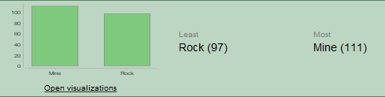  
- Podemos graficar las relaciones entre minas y rocas para todos los atributos y obtenemos el siguiente resultado   
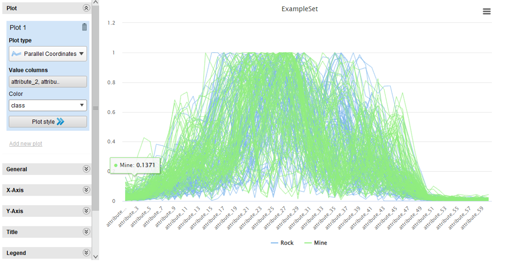  
- Para más claridad podemos usar las desviaciones:  
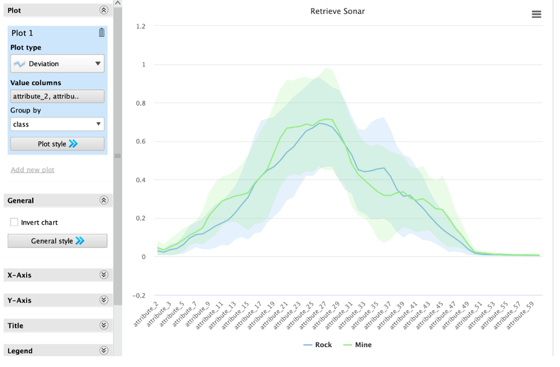  

Se resaltan regiones de atributos que marcan las mayores diferencias entre las dos clases: Atributos del 7 al 15, Atributos del 18 al 25, Atributos del 32 al 38, Atributos del 41 al 50  
Estas areas representan los atributos más importantes o que más caracterizan las clases, por lo que son los atributos que nos servirán más para discernir entre las clases.  

## Modelos a Usarse  
Para el presente trabajo utilizaremos 2 modelos para la clasificación: Naive Bayes y Regresión Logística. Para ambos modelos plantearemos un benchmark sin selección de atributos, uno con la selección nuestra (las áreas que resaltamos), y 3 con diferentes algoritmos de selección (Forward Selection, Backward Selection y Evolutionary Selection).  

Tenemos los siguientes procesos en RapidMiner  
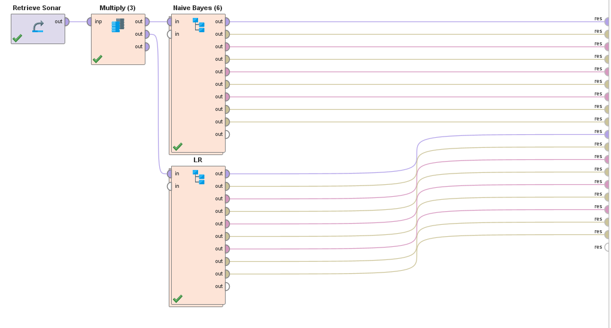  
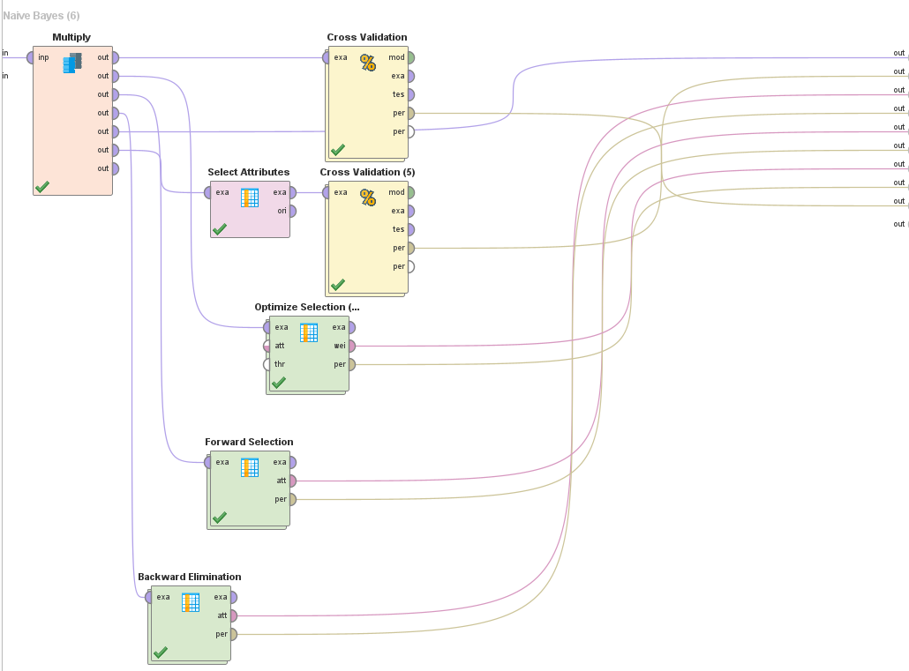  
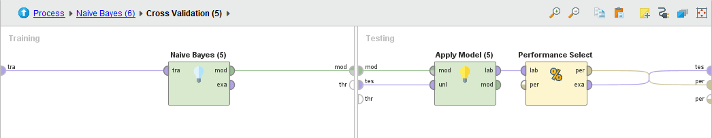  
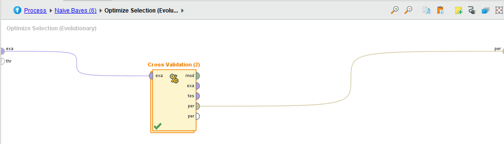  

Notas:  
- Todos los cross validations son 5-fold  
- Todos los algoritmos de selección tienen el mismo Subproceso (el cross validation)  
- Los subprocesos de los Cross Validation son iguales para ambos algoritmos. Por brevedad se muestra 1 solo, pero lo único que cambia es el modelo creado.  

## Resultados  
### Naive Bayes  
#### Benchmark  
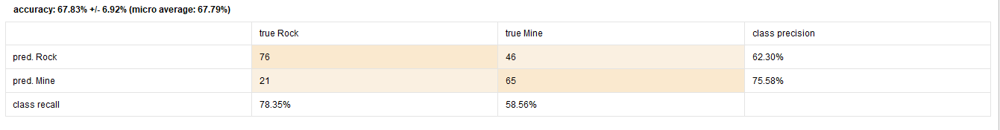  
#### Con Selección Previa de Atributos  
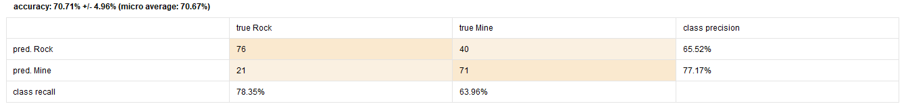  

#### Con Forward Selection
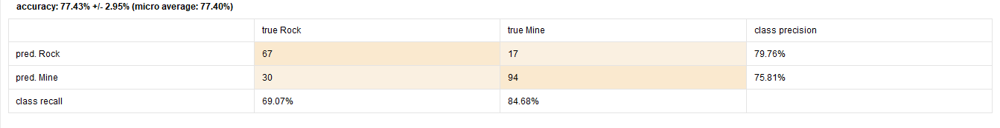  
Atributos:  
- attribute_15  
- attribute_17  
- attribute_18  

#### Con Backward Selection
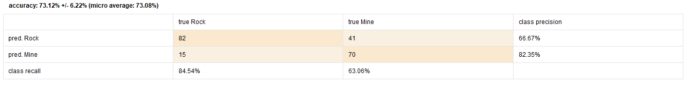  
Atributos **OMITIDOS**:  
- attribute_3  
- attribute_14  
- attribute_20  
- attribute_36  
- attribute_47  
- attribute_48  
- attribute_52  
- attribute_59  

#### Con Evolutionary Selection
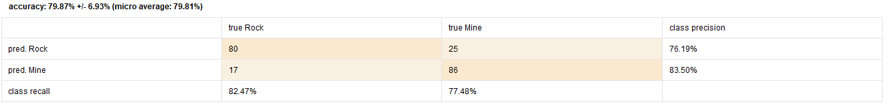  
Atributos:  
- attribute_6  
- attribute_7  
- attribute_9  
- attribute_11  
- attribute_12  
- attribute_13  
- attribute_15  
- attribute_16  
- attribute_17  
- attribute_18  
- attribute_19  
- attribute_20  
- attribute_24  
- attribute_25  
- attribute_27  
- attribute_31  
- attribute_35  
- attribute_36  
- attribute_37  
- attribute_41  
- attribute_43  
- attribute_44  
- attribute_46  
- attribute_49  
- attribute_54  

### Regresión Logística  
#### Benchmark  
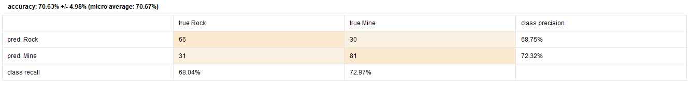  
#### Con Selección Previa de Atributos  
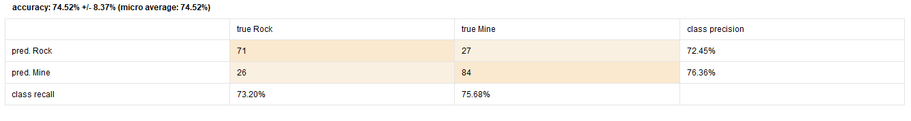  
#### Con Forward Selection  
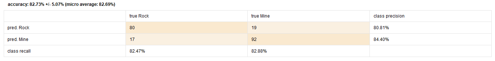  
Atributos:  
- attribute_4  
- attribute_11  
- attribute_32  
- attribute_36  
- attribute_45  
- attribute_54  
#### Con Backward Selection  
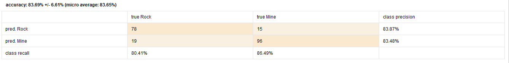  
Atributos **OMITIDOS**:  
- attribute_1  
- attribute_19  
- attribute_20  
- attribute_22  
- attribute_44  
- attribute_47  
- attribute_54  
- attribute_57  
#### Con Evolutionary Selection  
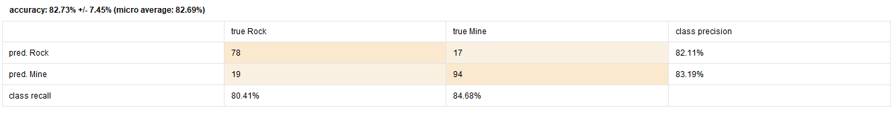  
Atributos:  
- attribute_6  
- attribute_7  
- attribute_10  
- attribute_11  
- attribute_12  
- attribute_13  
- attribute_15  
- attribute_18  
- attribute_19  
- attribute_20  
- attribute_24  
- attribute_25  
- attribute_27  
- attribute_32  
- attribute_37  
- attribute_38  
- attribute_41  
- attribute_44  
- attribute_46  
- attribute_49  
- attribute_54  
- attribute_55  

## Conclusiones  
- Se nota que el algoritmo Evolutionary se aproxima bastante a los atributos que nosotros tomamos como los más relevantes, forward selection toma pocos atributos que a veces coinciden y backward toma casi todos, pero omitiendo algunos de los que elegimos.  
- El modelo más performante es Regresión Logística con Backward selection (~83%) , pero dada la enorme cantidad de atributos que toma se puede sospechar de cierto sobre-ajuste, por lo que decidimos confiar en el modelo construido por Evolutionary selection, que tiene una precisión similar (~82%) y se aproxima más a lo investigado de los datos (los atributos que elegimos).  
- Los algoritmos de selección pueden dar mejoras de hasta 10% de precisión, lo cual es muy útil cuando no se posee muchos detalles de los atributos o lo que describen.  
- Estos algoritmos se deben usar con cuidado ya que pueden terminar en sobre-ajuste que no representa las relaciones entre variables en la realidad.  
