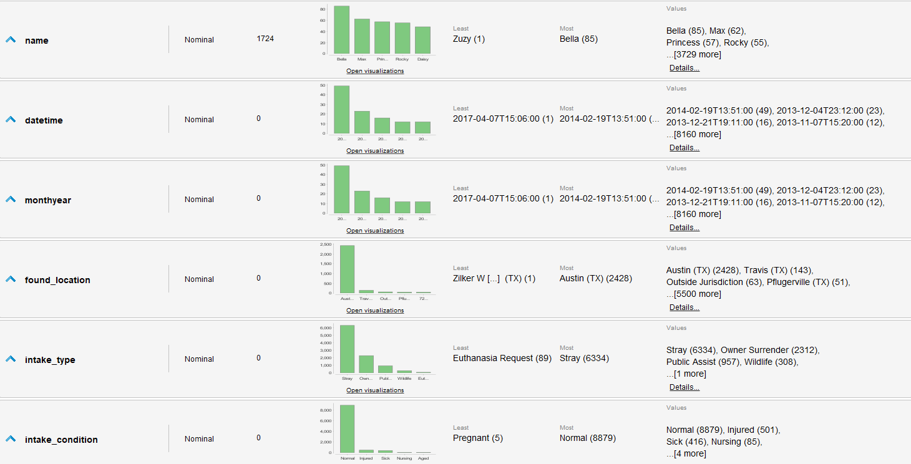
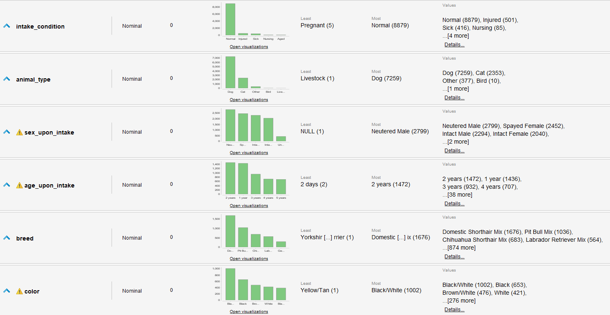
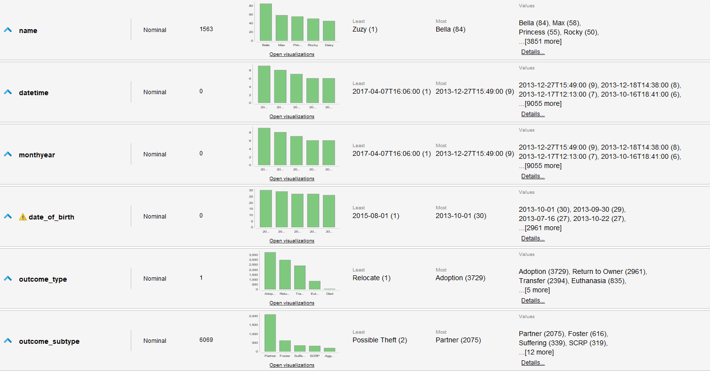

# Caso de estudio: Adopción en refugio animal  

## Introducción  
Se nos plantea un problema de clasificación, donde contamos con dos conjuntos de datos, de entrada de animales al refugio y de salida. Este ejercicio plantea un objetivo a primera vista noble, pero que conlleva una pre producción de datos considerable dada la naturaleza de los datos que se cuentan y los datos que podamos razonar que necesitamos o influyen en el objetivo. En este caso nos apoyaremos en el Turbo Prep de Rapidminer mucho.  

## Contexto del problema  
Todos los días nos encontramos con animales sin hogar, desde el perro en la calle al gato que queda en la casa de una familia que se vá o la cabra que se escapó de su granja, para todos estos animales corresponde y se merecen un hogar y en general son los refugios de animales quienes los reciben en periodos de transición para que estas criaturas puedan llegar a un nuevo hogar. Estos refugios suelen manejar fondos cortos y muchos animales, por lo que deben ser precavidos con quienes reciben y quienes pasan a otros refugios o casas de transición, por lo que hoy veremos un modelo que les permita intentar de predecir si una mascota es probable que sea adoptada en el refugio en el que está o si es mejor que vaya a otro a buscar su hogar permanente.  

## Evaluación de los datos  
Contamos con 2 datasets distintos, los cuales reflejan registros de entrada y salida de animales del refugio, más algunos datos de las mascotas y las características de su llegada y su salida. Ambos cuentan con 10.000 tuplas.  

### En los registros de entrada tenemos 12 atributos:  
- animal_id  (Categórico, id único de la mascota)  
- name (Categórico, nombre de la mascota)  
- datetime (FechaHora, cuando llego al refugio)  
- monthyear (FechaHora, cuando llego al refugio)  
- found_location (Categórico, dirección donde se encontró)  
- intake_type (Categórico, como llegó al refugio Ej: de la calle, entregado por el dueño, etc.)  
- intake_condition (Categórico, condición como llegó al refugio Ej: enfermo, normal, etc.)  
- animal_type (Categórico, que animal es)  
- sex_upon_intake (Categórico, el genero del animal y si está castrado o no)  
- age_upon_intake (Categórico, edad del animal cuando llegó)  
- breed (Categórico, raza del animal)  
- color (Categórico, color/es del animal)  

### En los registros de salida tenemos también 12 atributos:  
- animal_id  (Categórico, id único de la mascota)  
- name (Categórico, nombre de la mascota)  
- datetime (FechaHora, cuando llego al refugio)  
- monthyear (FechaHora, cuando llego al refugio)  
- date_of_birth (Fecha, cuando se estima que nació el animal)  
- outcome_type (Categórico, como se fue del refugio Ej: devuelto al dueño, adoptado, etc.)  
- outcome_subtype (Categórico, más detalle de como se fué, solo aplicable a algunos valores de outcome_type sino nulo)    
- animal_type (Categórico, que animal es)  
- sex_upon_outcome (Categórico, el genero del animal y si está castrado o no)  
- age_upon_outcome (Categórico, edad del animal cuando se fué)  
- breed (Categórico, raza del animal)  
- color (Categórico, color/es del animal)  

### De evaluar los datos sacamos las siguientes conclusiones y/o transformaciones necesarias:  
- datetime y monthyear de ambos sets contienen los mismos datos, por lo que una de las dos puede eliminarse.  
- Tenemos la el momento en el que llega o se va el animal y la edad respecto a estas fechas, probablemente sea más manejable utilizar un atributo de  fecha de nacimiento para ambas tablas para poder predecir mejor en base de este atributo importante (cachorros son más propensos a ser adoptados).  
- Datos como nombre o ubicación donde lo rescataron seguramente no influyan mucho sobre si se va a adoptar al animal o no.  
- Tenemos tanto el genero del animal como si está castrado o no en el mismo atributo, esto podríamos separarlo.  
- En la tabla de salidas tenemos amplias razones por la que el animal abandona el refugio, pero para el presente trabajo nos interesa si fue adoptado o no, por lo que podemos reducir el atributo a estas dos opciones unicamente.  
- Un subtipo de adopción es que fué enviado a una casa transitoria. A efectos de este estudio no lo consideraremos como caso favorable.  
- Las edades registradas fueron ingresadas como "n years" o "n weeks" entre otros, deberemos plantear una medida de tiempo común para todos estos para poder aprovechar el dato numérico y calcular las edades reales de las mascotas.  

## Estadísticas de los datos  
De Rapidminer sacamos los siguientes datos de los sets tal cual están:  
### Set Intakes:  
  
  

### Set Outcomes:  
  
  

## Transformaciones de los datos    
Se realizan los siguientes cambios y transformaciones a los datos:  
### En Intake:  
- se borra name y monthyear
- se arregla date de datetime (a tipo datetime correcto)
- age intake corregido a unicamente años (menores de 1 año quedan como 0 años)  
- age se convierte en atributo numérico  
- se divide sex a neutered y sex  
- se arreglan nulls o desconocidos mal definidos o no detectados  
- se calcula año de nacimiento de la mascota con age de llegada y fecha de llegada  

### En Outcome:  
- se cambia datetime a datetime-left para diferenciarlo del set Intakes  
- se borra name y monthyear
- se arregla date de datetime (a tipo datetime correcto)
- age intake corregido a unicamente años (menores de 1 año quedan como 0 años)  
- age se convierte en atributo numérico  
- se divide sex a neutered y sex  
- se arreglan nulls o desconocidos mal definidos o no detectados  
- se define columna adopted en base a outcome_type y subtype como binomial para saber si la mascota fue adoptada o no  

### Por último:  
- Se unen ambos sets en un unico set. Se realiza un Left Join tipo Intake -> Outcome para mantener las mascotas que aún no tienen hogar.  

> Todo esto se realiza con bastante facilidad en el turbo prep de Rapidminer, permitiendonos generar un nuevo csv con los datos transformados y generados.  
