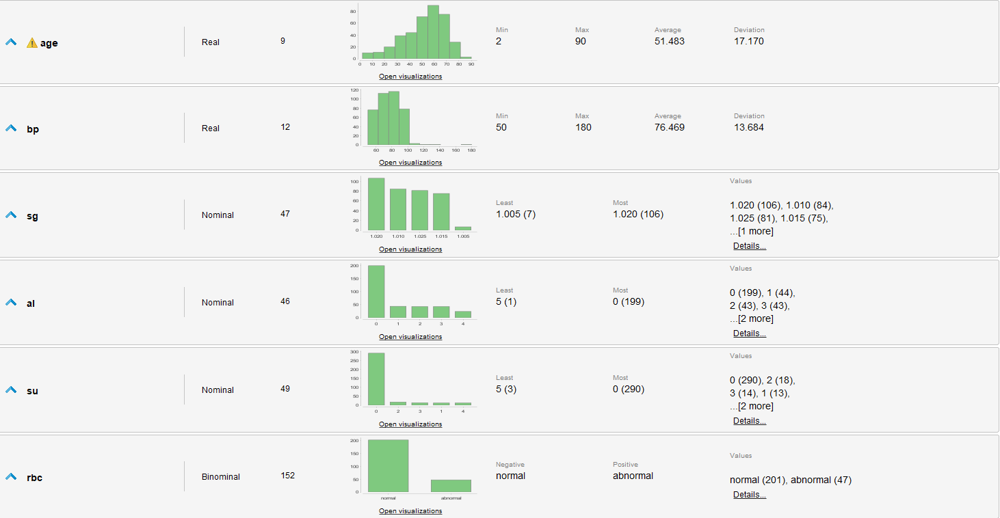
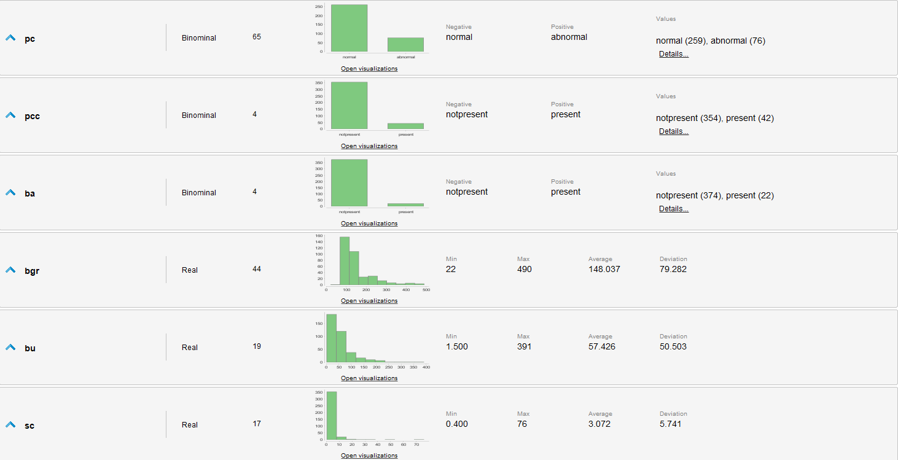
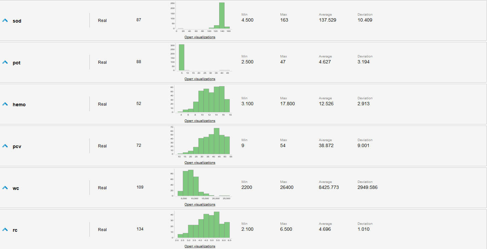
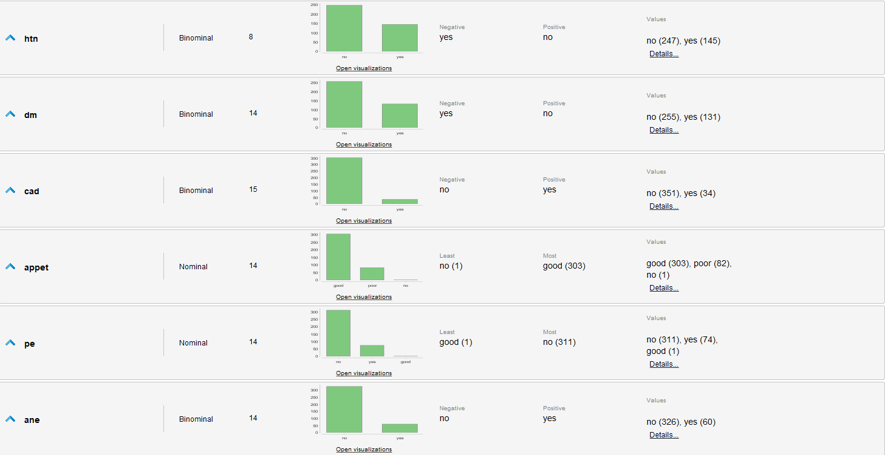
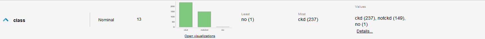

## Investigación de Caso: Sufrir Enfermedad Renal  
### de UCI Dataset [Chronic Kidney Disease](https://archive.ics.uci.edu/dataset/336/chronic+kidney+disease)  

## Introducción  
Este caso presenta un problema de clasificación, donde buscamos predecir si una persona padece una enfermedad crónica de los riñones a partir una serie amplia de datos de salud de las personas. Este ejercicio plantea un desafío de investigación importante, ya que el set y la publicación cuentan con muy poco contexto o información extra del problema, por lo que debemos asesorarnos nosotros mismos.  

## Comprensión del problema  
La detección temprana de enfermedades renales es esencial para lograr un tratamiento exitoso y no severamente caro. Los síntomas son prevalentes en la población más afectadas, como mayores de 60 años, por lo que no llaman la atención. Aproximadamente 10% de la población padece una enfermedad así, y su detección temprana es esencial, por lo que un modelo de aprendizaje de estadísticas puede asistir tanto a personal medico como a la población notar los indicios y buscar los tratamientos necesarios.   

Entre síntomas o signos de enfermedades renales se destacan:  
- Hinchazón de Cara  
- Pérdida de Apetito  
- Hipertensión  
- Anemia y Debilidad  
- Molestias no especificas  
    - Como dolores, comezón, crecimiento tardío, baja estatura, entre otros.  
- Molestias Urinarias  
    - Como ardor, obstrucción o poco volumen  
- Proteínas o Sangre en la orina  
- Niveles altos de Creatinina (+ de 1,4mg/dl) y Urea (+ de 40mg/dl) en sangre 
- Hemoglobina baja en sangre  
- Azúcar, proteínas sacáridas, colesterol, potasio, cloro, sodio, calcio, fósforo, bicarbonato entre otros en sangre.

Se destacan como personas de riesgo de padecer también a:
- Personas con Diabetes  
- Personas con hipertensión  0
- Personas con antecedentes familiares  
- Obesos, fumadores y/o mayores de 60 años   

> *Información tomada de García, G., Pandya, S., & Chavez, J. (2014). Guía completa para pacientes renales. Obtenido de Kidney Education Foundation: http://www.kidneyinspanish. com/chapters/ch13.php*

## Evaluación de Datos  
Se identifican 400 ejemplos con 25 atributos:  
1. Edad(Numérico)  
  	age en Años  
2. Presión Sanguínea(Numérico)  
    bp en mm/Hg  
3. Specific Gravity(Categórico)  
  	sg - (1.005,1.010,1.015,1.020,1.025)  
4. Albumin(Categórico)  
	al - (0,1,2,3,4,5)  
5. Azúcar(Categórico)  
	su - (0,1,2,3,4,5)  
6. Células Rojas(Binomial)  
	rbc - (normal,abnormal)  
7. Pus Cell (Binomial)  
	pc - (normal,abnormal)  
8. Pus Cell clumps(Binomial)  
	pcc - (present,notpresent)  
9. Bacteria(Binomial)  
	ba  - (present,notpresent)  
10. Glucosa en Sangre Random(Numérico)		  
	bgr en mgs/dl  
11. Sangre Urea(Numérico)	  
	bu en mgs/dl  
12. Serum Creatinine(Numérico)	  
	sc en mgs/dl  
13. Sodio(Numérico)  
	sod en mEq/L  
14. Potasio(Numérico)	  
	pot en mEq/L  
15. Hemoglobina (Numérico)  
	hemo en gms  
16. Packed  Cell Volume(Numérico)  
17. Células Blancas Cell Count(Numérico)  
	wc en cells/cumm  
18. Conteo Células Rojas(Numérico)	  
	rc en millions/cmm  
19. Hypertension (Binomial)	  
	htn - (yes,no)  
20. Diabetes Mellitus(Binomial)	  
	dm - (yes,no)  
21. Coronary Artery Disease(Binomial)  
	cad - (yes,no)  
22. Apetito (Binomial)	  
	appet - (good,poor)  
23. Pedal Edema(Binomial)  
	pe - (yes,no)	  
24. Anemia(Binomial)  
	ane - (yes,no)  
25. Class (Binomial, Objetivo)		  
	class - (ckd,notckd):  Si padece o no una enfermedad renal crónica (ckd por la sigla en inglés)

## Estadísticas de los datos sin procesar  
  
  
  
  
  

## Evaluaciones de los datos  
- Se identifican muchos valores faltantes en varios atributos, algunos tan graves que casi la mitad de los ejemplos los carecen.  
- appet, pe y class tienen valores erróneos.  
- Los datos están levemente desbalanceados, ya que hay mas casos que padecen de una enfermedad que los que no.  
- Existen outliers en varios atributos
