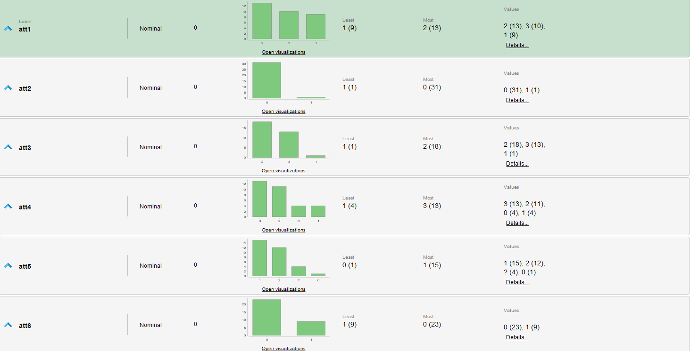
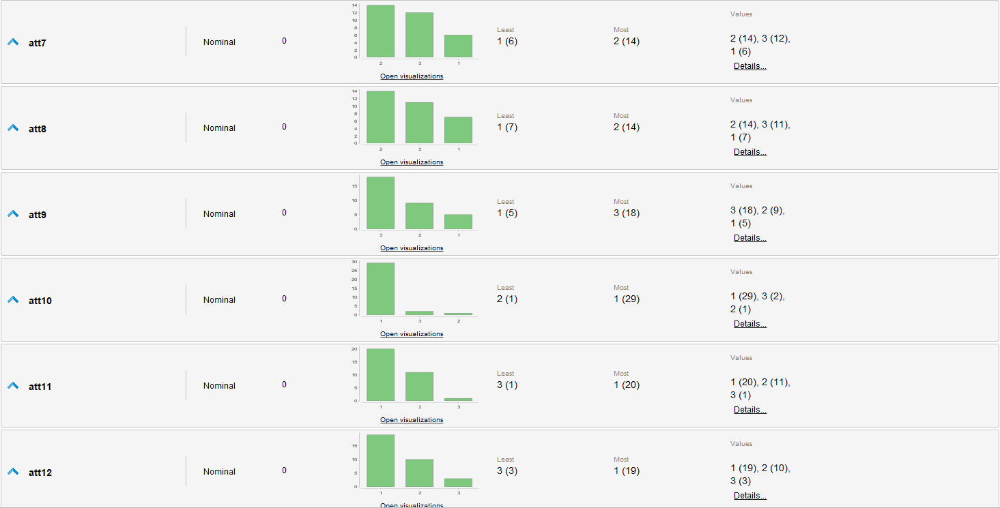
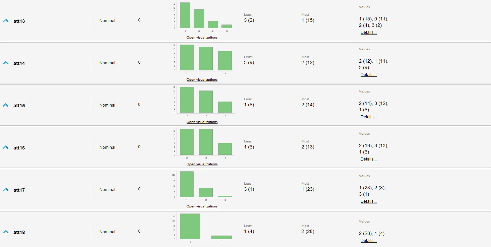
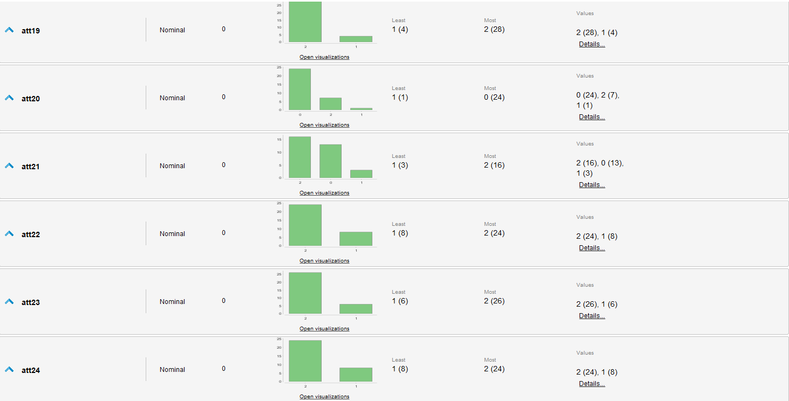
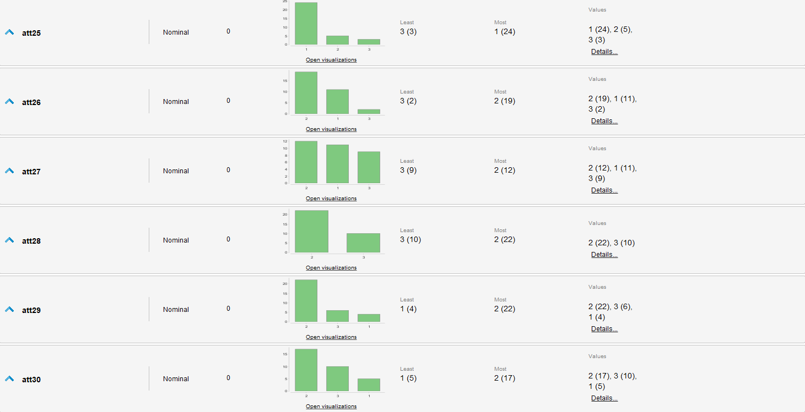
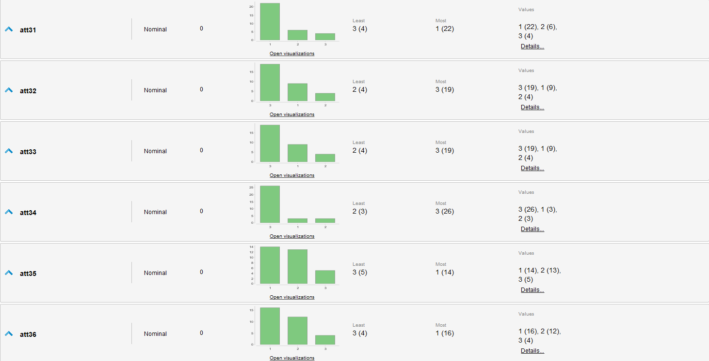
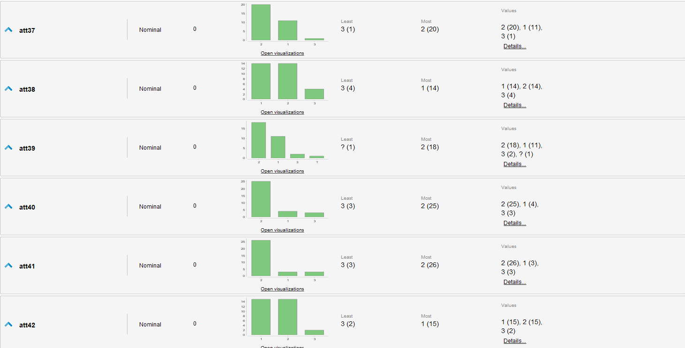
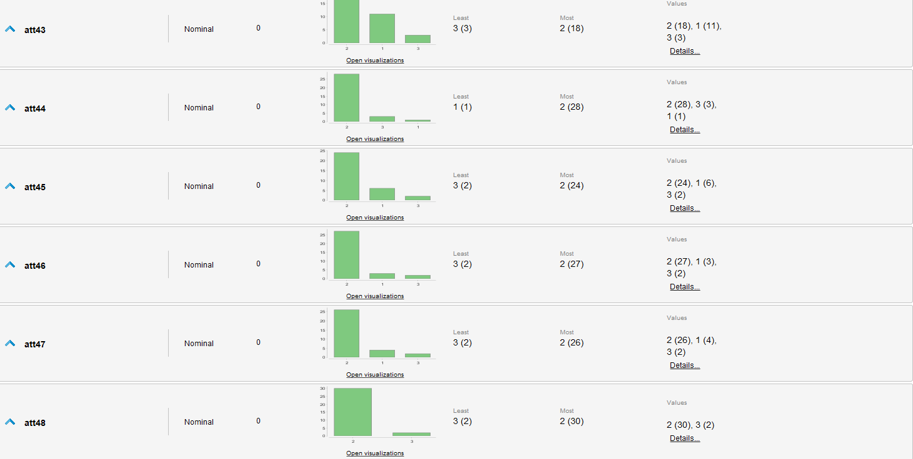
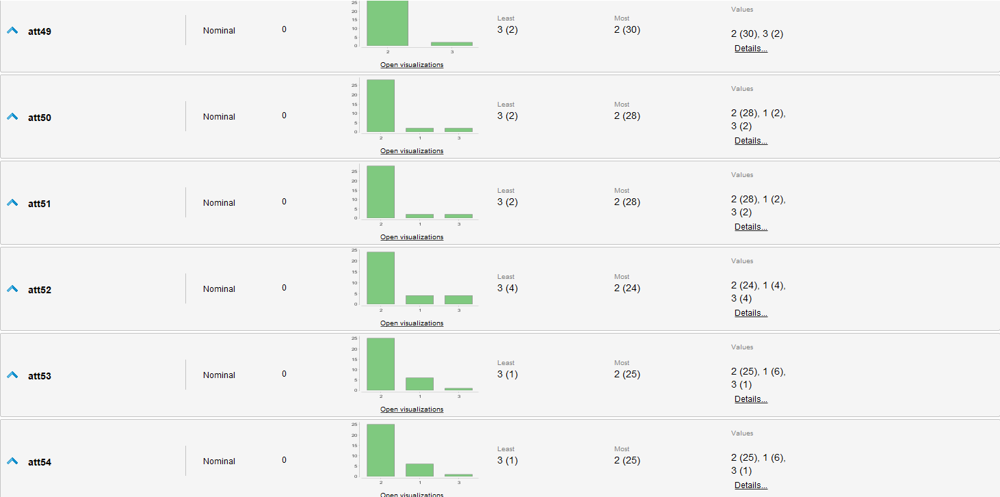
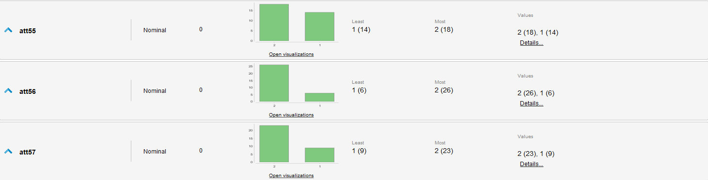

## Investigación de Caso Lung Cancer  
### de UCI Dataset: [Lung Cancer](https://archive.ics.uci.edu/dataset/62/lung+cancer)  

## Introducción
Este caso plantea un problema particular, al contarse con muy poca información respecto el contexto y significado de los datos, el amplio numero de atributos y los desbalanceos en los datos de cada atributo. Este ejercicio de clasificación presenta el problema de identificar entre 3 tipos de Cancer de Pulmón a partir de un conjunto reducido de datos pero con muchos atributos.  

## Resumen y Estadísticas del Set  

|**Característica**|**Descripción**|
|---|---|
|Cant. de Ejemplos|32|
|Cant. de Atributos|56|
|Tipo Ejercicio|Clasificación|
|Variable Objetivo |att1: Tipo categórico (1 al 3)|
|Tipos Atributos|Todos los atributos son categóricos, con valores entre 0 y 3|   

**Estadísticas**  
  

## Revisión de Datos  
En esta sección elaboraríamos en el significado, implicancias y características de los datos en el contexto del problema, pero para este caso no contamos con la información específica para estos datos.  
Resaltamos únicamente que todos los datos son categóricos y aunque tengan valores numéricos no podemos asumir naturaleza ordinal de estos. Similarmente en varios atributos se resaltan cantidades dispares de las diferentes categorías de cada uno.  

## Procesamiento de Datos  
El procesamiento de datos es complejo ya que no tenemos el contexto para discernir de manera racional que atributos aportan o no a la predicción que buscamos hacer, por lo que debemos soportarnos por heurísticas y estadísticas de los datos de por sí. Para el presente caso evaluaremos las diferencias de performance dadas las heurísticas más usadas: Forward Selection, Backward Selection y Evolutionary Selection.  
Por otro lado, hay 5 ejemplos con valores faltantes. Normalmente este es un numero insignificante pero dado el reducido numero de ejemplos disponibles decidimos tolerarlos y no eliminarlos. En algunos casos los algoritmos de Feature Selection omiten los atributos que contienen estos valores faltantes (att5 y att39), por lo que el impacto no es muy grave.  

